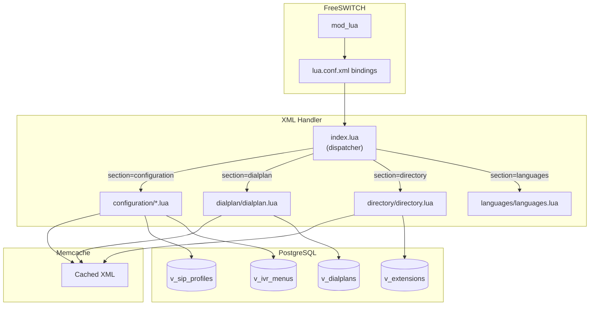

# FreeSWITCH XML Handler - Dynamic Configuration System

> How FusionPBX dynamically serves FreeSWITCH configuration via `mod_lua` and the XML handler system.

---

## Table of Contents
1. [Architecture Overview](#architecture-overview)
2. [XML Handler Entry Point](#xml-handler-entry-point)
3. [Configuration Handlers](#configuration-handlers)
4. [Dialplan Handler](#dialplan-handler)
5. [Directory Handler](#directory-handler)
6. [IVR Configuration Handler](#ivr-configuration-handler)
7. [Caching System](#caching-system)
8. [Database Tables Reference](#database-tables-reference)
9. [How to Replicate This](#how-to-replicate-this)

---

## Architecture Overview

FusionPBX uses FreeSWITCH's `mod_lua` to provide dynamic XML configuration. Instead of static XML files, Lua scripts query the database and generate XML on-the-fly.



### FreeSWITCH Binding Configuration

In FreeSWITCH's `lua.conf.xml`:

```xml
<configuration name="lua.conf" description="LUA Configuration">
  <settings>
    <param name="xml-handler-script" value="app/xml_handler/index.lua"/>
    <param name="xml-handler-bindings" value="configuration,dialplan,directory,languages"/>
  </settings>
</configuration>
```

This tells FreeSWITCH: "For configuration, dialplan, directory, and languages sections, call Lua instead of reading static files."

---

## XML Handler Entry Point

**File:** `app/switch/resources/scripts/app/xml_handler/index.lua`

This is the **dispatcher** that routes requests to the appropriate handler.

### How It Works

```lua
-- index.lua - Entry point for all XML requests

-- Get request parameters from FreeSWITCH
domain_name = params:getHeader("domain")
user = params:getHeader("user")
call_context = params:getHeader("Caller-Context")
destination_number = params:getHeader("Caller-Destination-Number")

-- Prepare API object for FreeSWITCH commands
api = freeswitch.API()

-- Route to appropriate handler based on section
if (XML_REQUEST["section"] == "configuration") then
    -- Load config handler for the requested configuration type
    configuration = scripts_dir.."/app/xml_handler/resources/scripts/configuration/"
        ..XML_REQUEST["key_value"]..".lua"
    if (file_exists(configuration)) then
        dofile(configuration)
    end
end

if (XML_REQUEST["section"] == "directory") then
    dofile(scripts_dir.."/app/xml_handler/resources/scripts/directory/directory.lua")
end

if (XML_REQUEST["section"] == "dialplan") then
    dofile(scripts_dir.."/app/xml_handler/resources/scripts/dialplan/dialplan.lua")
end

if (XML_REQUEST["section"] == "languages") then
    dofile(scripts_dir.."/app/xml_handler/resources/scripts/languages/languages.lua")
end
```

### XML_REQUEST Object

FreeSWITCH passes these parameters:

| Parameter | Description | Example Values |
|-----------|-------------|----------------|
| `section` | Type of XML requested | `configuration`, `dialplan`, `directory` |
| `tag_name` | XML tag being requested | `profile`, `user`, `extension` |
| `key_name` | Key attribute name | `name`, `id` |
| `key_value` | Key attribute value | `sofia.conf`, `internal`, `1001` |

---

## Configuration Handlers

Located in: `app/xml_handler/resources/scripts/configuration/`

| Handler | Purpose |
|---------|---------|
| `sofia.conf.lua` | SIP profiles, gateways, global settings |
| `ivr.conf.lua` | IVR menu XML generation |
| `conference.conf.lua` | Conference room settings |
| `callcenter.conf.lua` | Call center queues |
| `acl.conf.lua` | Access control lists |
| `local_stream.conf.lua` | Music on hold streams |
| `translate.conf.lua` | Number translations |

### sofia.conf.lua - SIP Profile Configuration

**This is how sofia.conf gets loaded dynamically!**

```lua
-- sofia.conf.lua - Generates Sofia SIP configuration

-- Include required libraries
local Xml = require "resources.functions.xml"
local cache = require "resources.functions.cache"
local Database = require "resources.functions.database"

-- Build cache key
local hostname = trim(api:execute("hostname", ""))
local sofia_cache_key = hostname .. ":configuration:sofia.conf"

-- Check cache first
XML_STRING, err = cache.get(sofia_cache_key)

if not XML_STRING then
    -- Connect to database
    dbh = Database.new('system')
    
    -- Start building XML
    local xml = Xml:new()
    xml:append([[<?xml version="1.0" encoding="UTF-8" standalone="no"?>]])
    xml:append([[<document type="freeswitch/xml">]])
    xml:append([[<section name="configuration">]])
    xml:append([[<configuration name="sofia.conf" description="sofia Endpoint">]])
    
    -- Get global settings from v_sofia_global_settings
    sql = "select * from v_sofia_global_settings "
        .. "where global_setting_enabled = true "
        .. "order by global_setting_name asc"
    xml:append([[<global_settings>]])
    dbh:query(sql, {}, function(row)
        xml:append([[<param name="]] .. row.global_setting_name 
            .. [[" value="]] .. row.global_setting_value .. [["/>]])
    end)
    xml:append([[</global_settings>]])
    
    -- Get SIP profiles and settings from v_sip_profiles + v_sip_profile_settings
    sql = "select p.sip_profile_uuid, p.sip_profile_name, "
        .. "s.sip_profile_setting_name, s.sip_profile_setting_value "
        .. "from v_sip_profiles as p, v_sip_profile_settings as s "
        .. "where s.sip_profile_setting_enabled = true "
        .. "and p.sip_profile_enabled = true "
        .. "and (p.sip_profile_hostname = :hostname or p.sip_profile_hostname is null) "
        .. "and p.sip_profile_uuid = s.sip_profile_uuid "
        .. "order by p.sip_profile_name asc"
    
    xml:append([[<profiles>]])
    dbh:query(sql, {hostname = hostname}, function(row)
        -- For each new profile, open profile tag
        if (sip_profile_name ~= row.sip_profile_name) then
            xml:append([[<profile name="]] .. row.sip_profile_name .. [[">]])
            
            -- Get gateways for this profile from v_gateways
            gateway_sql = "select * from v_gateways "
                .. "where profile = :profile and enabled = true"
            xml:append([[<gateways>]])
            dbh:query(gateway_sql, {profile = row.sip_profile_name}, function(gw)
                xml:append([[<gateway name="]] .. gw.gateway_uuid .. [[">]])
                xml:append([[<param name="username" value="]] .. gw.username .. [["/>]])
                xml:append([[<param name="password" value="]] .. gw.password .. [["/>]])
                xml:append([[<param name="proxy" value="]] .. gw.proxy .. [["/>]])
                -- ... more gateway params
                xml:append([[</gateway>]])
            end)
            xml:append([[</gateways>]])
            
            -- Get domains for this profile from v_sip_profile_domains
            xml:append([[<domains>]])
            domain_sql = "SELECT * FROM v_sip_profile_domains "
                .. "WHERE sip_profile_uuid = :uuid"
            dbh:query(domain_sql, {uuid = row.sip_profile_uuid}, function(d)
                xml:append([[<domain name="]] .. d.sip_profile_domain_name 
                    .. [[" alias="]] .. d.sip_profile_domain_alias 
                    .. [[" parse="]] .. d.sip_profile_domain_parse .. [["/>]])
            end)
            xml:append([[</domains>]])
            
            xml:append([[<settings>]])
        end
        
        -- Add each setting
        xml:append([[<param name="]] .. row.sip_profile_setting_name 
            .. [[" value="]] .. row.sip_profile_setting_value .. [["/>]])
    end)
    xml:append([[</settings>]])
    xml:append([[</profile>]])
    xml:append([[</profiles>]])
    
    xml:append([[</configuration>]])
    xml:append([[</section>]])
    xml:append([[</document>]])
    
    XML_STRING = xml:build()
    
    -- Store in cache (default 3600 seconds)
    cache.set(sofia_cache_key, XML_STRING, expire["sofia"])
    
    dbh:release()
end

-- Return XML_STRING to FreeSWITCH
```

### Generated Sofia XML Example

```xml
<?xml version="1.0" encoding="UTF-8" standalone="no"?>
<document type="freeswitch/xml">
  <section name="configuration">
    <configuration name="sofia.conf" description="sofia Endpoint">
      <global_settings>
        <param name="log-level" value="0"/>
        <param name="debug-presence" value="0"/>
      </global_settings>
      <profiles>
        <profile name="internal">
          <gateways>
            <!-- Gateways from v_gateways -->
          </gateways>
          <domains>
            <domain name="all" alias="true" parse="true"/>
          </domains>
          <settings>
            <param name="context" value="public"/>
            <param name="sip-port" value="5060"/>
            <param name="sip-ip" value="$${local_ip_v4}"/>
            <!-- More settings from v_sip_profile_settings -->
          </settings>
        </profile>
        <profile name="external">
          <!-- ... -->
        </profile>
      </profiles>
    </configuration>
  </section>
</document>
```

---

## Dialplan Handler

**File:** `app/xml_handler/resources/scripts/dialplan/dialplan.lua`

Generates dialplan XML from `v_dialplans.dialplan_xml` column.

### Key Logic

```lua
-- dialplan.lua

-- Get cached dialplan XML
local dialplan_cache_key = "dialplan:" .. call_context
XML_STRING, err = cache.get(dialplan_cache_key)

if (not XML_STRING) then
    -- Connect to database
    dbh = Database.new('system')
    
    -- Start XML
    local xml = Xml:new()
    xml:append([[<?xml version="1.0" encoding="UTF-8" standalone="no"?>]])
    xml:append([[<document type="freeswitch/xml">]])
    xml:append([[<section name="dialplan" description="">]])
    xml:append([[<context name="]] .. call_context .. [[">]])
    
    -- Two modes: 'single' or 'multiple'
    if (dialplan_mode == "single") then
        -- For inbound routes: lookup specific destination
        sql = "SELECT dialplan_xml FROM v_dialplans "
            .. "WHERE dialplan_uuid IN ("
            .. "  SELECT dialplan_uuid FROM v_destinations "
            .. "  WHERE destination_number = :destination_number"
            .. ") "
            .. "AND dialplan_enabled = true "
            .. "ORDER BY dialplan_order ASC"
    else
        -- For internal calls: get all dialplans for context
        sql = "select dialplan_xml from v_dialplans as p "
            .. "where p.dialplan_context in (:call_context, '${domain_name}', 'global') "
            .. "and p.dialplan_enabled = true "
            .. "order by p.dialplan_order asc"
    end
    
    dbh:query(sql, {call_context = call_context, destination_number = destination_number}, 
        function(row)
            -- Append pre-generated XML from database
            xml:append(row.dialplan_xml)
        end
    )
    
    xml:append([[</context>]])
    xml:append([[</section>]])
    xml:append([[</document>]])
    
    XML_STRING = xml:build()
    
    -- Cache the result
    cache.set(dialplan_cache_key, XML_STRING, expire["dialplan"])
end
```

### Key Insight: Pre-Generated XML

The `dialplan_xml` column in `v_dialplans` contains **pre-generated XML** that was built by PHP when the dialplan was saved in the web UI. The Lua handler just queries and concatenates these XML snippets.

---

## Directory Handler

**File:** `app/xml_handler/resources/scripts/directory/directory.lua`

Handles user authentication (SIP REGISTER) and user lookups.

### Action Types

| Action | Purpose |
|--------|---------|
| `sip_auth` | SIP registration/authentication |
| `user_call` | Someone is calling this user |
| `group_call` | Someone dialed a call group |
| `message-count` | MWI (message waiting indicator) check |
| `reverse-auth-lookup` | Reverse lookup for auth |

### Authentication Flow

```lua
-- directory.lua - User authentication

-- Dispatch based on action
if (action == "group_call") then
    dofile(scripts_dir.."/directory/action/group_call.lua")
elseif (action == "message-count") then
    dofile(scripts_dir.."/directory/action/message-count.lua")
else
    -- Default: sip_auth or user_call
    
    -- Query extension from database
    local sql = "SELECT "
        .. "e.extension_uuid, e.extension, e.password, e.number_alias, "
        .. "e.effective_caller_id_name, e.effective_caller_id_number, "
        .. "e.outbound_caller_id_name, e.outbound_caller_id_number, "
        .. "e.user_context, e.toll_allow, e.call_timeout, "
        .. "e.do_not_disturb, e.forward_all_enabled, e.forward_all_destination "
        .. "-- ... many more fields"
        .. "FROM v_extensions as e "
        .. "WHERE e.domain_uuid = :domain_uuid "
        .. "AND (e.extension = :user OR e.number_alias = :user) "
        .. "AND e.enabled = 'true'"
    
    dbh:query(sql, {domain_uuid = domain_uuid, user = user}, function(row)
        extension_uuid = row.extension_uuid
        password = row.password
        -- ... capture all fields
    end)
    
    -- Build user directory XML
    if (password) then
        local xml = Xml:new()
        xml:append([[<?xml version="1.0" encoding="UTF-8" standalone="no"?>]])
        xml:append([[<document type="freeswitch/xml">]])
        xml:append([[<section name="directory">]])
        xml:append([[<domain name="]] .. domain_name .. [[" alias="true">]])
        xml:append([[<groups>]])
        xml:append([[<group name="default">]])
        xml:append([[<users>]])
        xml:append([[<user id="]] .. extension .. [[">]])
        
        -- Parameters (password, voicemail settings, etc.)
        xml:append([[<params>]])
        xml:append([[<param name="password" value="]] .. password .. [["/>]])
        xml:append([[<param name="vm-enabled" value="]] .. vm_enabled .. [["/>]])
        xml:append([[<param name="dial-string" value="]] .. dial_string .. [["/>]])
        xml:append([[</params>]])
        
        -- Variables (caller ID, context, toll_allow, etc.)
        xml:append([[<variables>]])
        xml:append([[<variable name="domain_uuid" value="]] .. domain_uuid .. [["/>]])
        xml:append([[<variable name="extension_uuid" value="]] .. extension_uuid .. [["/>]])
        xml:append([[<variable name="user_context" value="]] .. user_context .. [["/>]])
        xml:append([[<variable name="effective_caller_id_name" value="]] .. effective_caller_id_name .. [["/>]])
        xml:append([[<variable name="toll_allow" value="]] .. toll_allow .. [["/>]])
        -- ... many more variables
        xml:append([[</variables>]])
        
        xml:append([[</user>]])
        xml:append([[</users>]])
        xml:append([[</group>]])
        xml:append([[</groups>]])
        xml:append([[</domain>]])
        xml:append([[</section>]])
        xml:append([[</document>]])
        
        XML_STRING = xml:build()
    end
end
```

### Generated Directory XML

```xml
<?xml version="1.0" encoding="UTF-8" standalone="no"?>
<document type="freeswitch/xml">
  <section name="directory">
    <domain name="example.com" alias="true">
      <groups>
        <group name="default">
          <users>
            <user id="1001" number-alias="1001">
              <params>
                <param name="password" value="securepass123"/>
                <param name="vm-enabled" value="true"/>
                <param name="dial-string" value="{...}${sofia_contact(...)}"/>
              </params>
              <variables>
                <variable name="domain_uuid" value="abc-123"/>
                <variable name="extension_uuid" value="ext-456"/>
                <variable name="user_context" value="example.com"/>
                <variable name="effective_caller_id_name" value="John Doe"/>
                <variable name="effective_caller_id_number" value="1001"/>
                <variable name="toll_allow" value="domestic,local"/>
                <variable name="call_timeout" value="30"/>
              </variables>
            </user>
          </users>
        </group>
      </groups>
    </domain>
  </section>
</document>
```

---

## IVR Configuration Handler

**File:** `app/xml_handler/resources/scripts/configuration/ivr.conf.lua`

Generates IVR menu XML dynamically when FreeSWITCH requests it.

### Key Logic

```lua
-- ivr.conf.lua

-- Get IVR menu UUID from FreeSWITCH request
ivr_menu_uuid = params:getHeader("Menu-Name")

-- Check cache
local ivr_menu_cache_key = "configuration:ivr.conf:" .. ivr_menu_uuid
XML_STRING, err = cache.get(ivr_menu_cache_key)

if not XML_STRING then
    -- Use recursive CTE to get IVR menu and any sub-menus
    local sql = [[
        with recursive ivr_menus as (
            select * from v_ivr_menus
            where ivr_menu_uuid = :ivr_menu_uuid
            and ivr_menu_enabled = true
            union all
            select child.* from v_ivr_menus as child, ivr_menus as parent
            where child.ivr_menu_parent_uuid = parent.ivr_menu_uuid
            and child.ivr_menu_enabled = true
        )
        select * from ivr_menus
    ]]
    
    dbh:query(sql, {ivr_menu_uuid = ivr_menu_uuid}, function(row)
        -- Build IVR menu XML
        xml:append([[<menu name="]] .. row.ivr_menu_uuid .. [[" ...>]])
        
        -- Get menu options from v_ivr_menu_options
        local option_sql = "SELECT * FROM v_ivr_menu_options "
            .. "WHERE ivr_menu_uuid = :uuid ORDER BY ivr_menu_option_order"
        dbh:query(option_sql, {uuid = row.ivr_menu_uuid}, function(opt)
            xml:append([[<entry action="]] .. opt.ivr_menu_option_action 
                .. [[" digits="]] .. opt.ivr_menu_option_digits 
                .. [[" param="]] .. opt.ivr_menu_option_param .. [["/>]])
        end)
        
        xml:append([[</menu>]])
    end)
end
```

---

## Caching System

FusionPBX uses FreeSWITCH's built-in memcache (or file-based caching) to avoid hitting the database on every request.

### Cache Keys

| Key Pattern | Content |
|-------------|---------|
| `{hostname}:configuration:sofia.conf` | Full Sofia configuration XML |
| `dialplan:{context}` | Dialplan XML for a context |
| `dialplan:{context}:{destination}` | Single dialplan (single mode) |
| `configuration:ivr.conf:{uuid}` | Specific IVR menu XML |
| `directory:{domain}:{user}` | User directory entry |

### Cache Operations

```lua
local cache = require "resources.functions.cache"

-- Get from cache
local xml_string, err = cache.get("dialplan:example.com")

-- Set in cache (with expiration in seconds)
cache.set("dialplan:example.com", xml_string, 3600)

-- Delete from cache (called after config changes)
cache.delete("dialplan:example.com")
```

### Cache Invalidation

When configuration changes in the web UI (PHP), the cache is invalidated:

```php
// After saving SIP profile
$cache = new cache;
$cache->delete($hostname.":configuration:sofia.conf");

// After saving dialplan
$cache->delete("dialplan:".$dialplan_context);

// After saving IVR menu
$cache->delete("configuration:ivr.conf:".$ivr_menu_uuid);
```

---

## Database Tables Reference

### Sofia/SIP Configuration

| Table | Purpose |
|-------|---------|
| `v_sofia_global_settings` | Global Sofia settings (log-level, etc.) |
| `v_sip_profiles` | SIP profiles (internal, external) |
| `v_sip_profile_settings` | Settings for each profile |
| `v_sip_profile_domains` | Domains associated with profiles |
| `v_gateways` | SIP trunks/gateways |

### Dialplan

| Table | Purpose |
|-------|---------|
| `v_dialplans` | Dialplan entries with pre-generated XML |
| `v_dialplan_details` | Conditions and actions (used by PHP) |
| `v_destinations` | Inbound DID destinations |

### Directory/Extensions

| Table | Purpose |
|-------|---------|
| `v_extensions` | User/extension data |
| `v_extension_settings` | Custom settings per extension |
| `v_voicemails` | Voicemail configuration |

### IVR

| Table | Purpose |
|-------|---------|
| `v_ivr_menus` | IVR menu definitions |
| `v_ivr_menu_options` | DTMF option mappings |

---

## How to Replicate This

### Step 1: Configure FreeSWITCH Lua Bindings

In `lua.conf.xml`:
```xml
<configuration name="lua.conf" description="LUA Configuration">
  <settings>
    <param name="xml-handler-script" value="/path/to/xml_handler/index.lua"/>
    <param name="xml-handler-bindings" value="configuration,dialplan,directory"/>
  </settings>
</configuration>
```

### Step 2: Create Database Schema

```sql
-- SIP Profiles
CREATE TABLE sip_profiles (
    sip_profile_uuid UUID PRIMARY KEY,
    sip_profile_name VARCHAR(255),
    sip_profile_enabled BOOLEAN DEFAULT true
);

CREATE TABLE sip_profile_settings (
    setting_uuid UUID PRIMARY KEY,
    sip_profile_uuid UUID REFERENCES sip_profiles,
    setting_name VARCHAR(255),
    setting_value TEXT,
    setting_enabled BOOLEAN DEFAULT true
);

-- Dialplans (store pre-generated XML)
CREATE TABLE dialplans (
    dialplan_uuid UUID PRIMARY KEY,
    domain_uuid UUID,
    dialplan_name VARCHAR(255),
    dialplan_context VARCHAR(255),
    dialplan_order INTEGER,
    dialplan_enabled BOOLEAN,
    dialplan_xml TEXT  -- Pre-generated XML stored here!
);

-- Extensions
CREATE TABLE extensions (
    extension_uuid UUID PRIMARY KEY,
    domain_uuid UUID,
    extension VARCHAR(32),
    password VARCHAR(255),
    effective_caller_id_name VARCHAR(255),
    user_context VARCHAR(255),
    enabled BOOLEAN DEFAULT true
);
```

### Step 3: Create Lua Handler

```lua
-- index.lua
require "resources.functions.config"  -- Load DB connection from config

if (XML_REQUEST["section"] == "configuration") then
    local config_file = scripts_dir.."/configuration/"..XML_REQUEST["key_value"]..".lua"
    if file_exists(config_file) then
        dofile(config_file)
    end
elseif (XML_REQUEST["section"] == "dialplan") then
    dofile(scripts_dir.."/dialplan/dialplan.lua")
elseif (XML_REQUEST["section"] == "directory") then
    dofile(scripts_dir.."/directory/directory.lua")
end
```

### Step 4: Implement Cache Invalidation

When saving configuration via your UI:
```javascript
// After saving SIP profile
await api.post('/cache/delete', { key: 'configuration:sofia.conf' })
await api.post('/freeswitch/reload', { module: 'mod_sofia' })

// After saving dialplan
await api.post('/cache/delete', { key: `dialplan:${context}` })
await api.post('/freeswitch/reloadxml')
```

---

## Summary

| Component | Database Table | Cache Key | Handler Script |
|-----------|---------------|-----------|----------------|
| Sofia Config | `v_sip_profiles`, `v_sip_profile_settings` | `{host}:configuration:sofia.conf` | `configuration/sofia.conf.lua` |
| Dialplan | `v_dialplans` | `dialplan:{context}` | `dialplan/dialplan.lua` |
| Directory | `v_extensions` | (per-request) | `directory/directory.lua` |
| IVR Menus | `v_ivr_menus`, `v_ivr_menu_options` | `configuration:ivr.conf:{uuid}` | `configuration/ivr.conf.lua` |
| ACL | `v_access_controls` | | `configuration/acl.conf.lua` |
| Call Center | `v_call_center_queues` | | `configuration/callcenter.conf.lua` |
