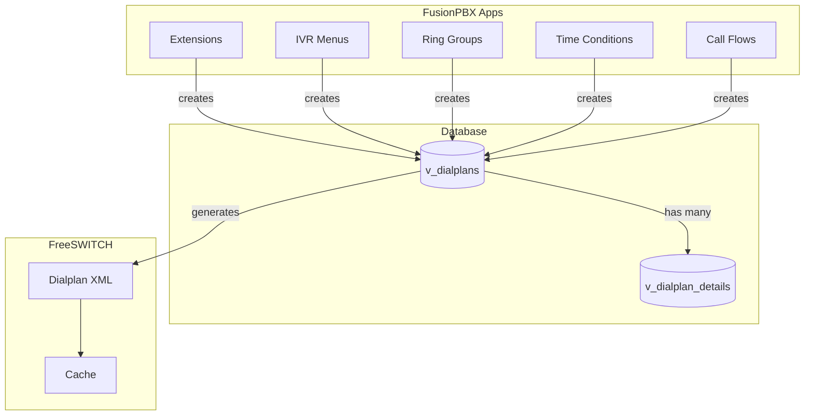

# FusionPBX Apps Reference

> Comprehensive guide to FusionPBX applications, categorized by function, with essential vs nice-to-have recommendations.

---

## Table of Contents
1. [App Categories](#app-categories)
2. [Essential Apps (Must Have)](#essential-apps-must-have)
3. [Important Apps (Should Have)](#important-apps-should-have)
4. [Nice-to-Have Apps](#nice-to-have-apps)
5. [Device Provisioning Apps](#device-provisioning-apps)
6. [How the Dialplan System Works](#how-the-dialplan-system-works)
7. [Database Schema](#database-schema)
8. [Dialplan XML Generation](#dialplan-xml-generation)

---

## App Categories

FusionPBX has **80+ apps** organized by function:

| Category | Examples |
|----------|----------|
| **Core Routing** | dialplans, destinations, extensions |
| **Call Flow** | ivr_menus, ring_groups, time_conditions, call_flows |
| **Voicemail** | voicemails, voicemail_greetings |
| **Conferences** | conferences, conference_centers, conference_profiles, conference_controls |
| **Call Center** | call_centers, call_center_active, fifo, fifo_list |
| **Recording** | recordings, call_recordings, xml_cdr |
| **Device Provisioning** | provision, devices, yealink, polycom, grandstream, fanvil, cisco, snom |
| **SIP/Sofia** | sip_profiles, sip_status, sofia_global_settings, gateways, bridges |
| **Security** | access_controls, event_guard, call_block |
| **Media** | music_on_hold, streams, recordings, phrases, tones |
| **User Features** | follow_me, call_forward, click_to_call |
| **Advanced** | fax, fax_queue, number_translations, vars |

---

## Essential Apps (Must Have)

These are the **core apps** you need to replicate for a functional PBX:

### 1. `extensions` - SIP Extensions
- **Purpose**: Configure SIP extensions (user phone accounts)
- **Database**: `v_extensions`
- **Key Fields**: `extension`, `password`, `effective_caller_id_name`, `effective_caller_id_number`, `user_context`
- **Generates**: User directory XML for FreeSWITCH authentication

```sql
-- Example query
SELECT extension, password, effective_caller_id_name, user_context 
FROM v_extensions 
WHERE domain_uuid = :domain_uuid AND enabled = 'true';
```

### 2. `dialplans` - Dialplan Manager
- **Purpose**: The core routing engine - conditions and actions for call routing
- **Database**: `v_dialplans`, `v_dialplan_details`
- **Creates**: XML dialplan entries that FreeSWITCH processes
- **Used By**: All other routing apps (IVR, ring groups, etc.)

### 3. `destinations` - Inbound/Outbound Numbers
- **Purpose**: Define DIDs and routing destinations
- **Database**: `v_destinations`
- **Types**: `inbound` (incoming DIDs) and `outbound` (external destinations)
- **Links To**: Points to extensions, IVRs, ring groups, time conditions, etc.

### 4. `gateways` - SIP Trunks
- **Purpose**: Configure connections to carriers/SIP providers
- **Database**: `v_gateways`
- **Generates**: XML files in `/etc/freeswitch/sip_profiles/external/`

### 5. `voicemails` - Voicemail System
- **Purpose**: Manage voicemail boxes and messages
- **Database**: `v_voicemails`, `v_voicemail_messages`
- **Key Fields**: `voicemail_id`, `voicemail_password`, `voicemail_mail_to`

### 6. `sip_profiles` - Sofia Profiles
- **Purpose**: Configure FreeSWITCH SIP endpoints (internal/external)
- **Database**: `v_sip_profiles`, `v_sip_profile_settings`
- **Generates**: XML files in `/etc/freeswitch/sip_profiles/`

---

## Important Apps (Should Have)

These apps provide essential business PBX features:

### 7. `ivr_menus` - Auto Attendant / IVR
- **Purpose**: Interactive voice response menus ("Press 1 for sales...")
- **Database**: `v_ivr_menus`, `v_ivr_menu_options`
- **Key Features**:
  - Greeting recording/phrase
  - DTMF digit mapping to destinations
  - Timeout handling
  - Invalid option handling

```php
// IVR menu destination format
$select_value['dialplan'] = "transfer:${destination} XML ${context}";
$select_value['ivr'] = "menu-exec-app:transfer ${destination} XML ${context}";
```

### 8. `ring_groups` - Hunt Groups
- **Purpose**: Ring multiple extensions simultaneously or sequentially
- **Database**: `v_ring_groups`, `v_ring_group_destinations`
- **Strategies**: `simultaneous`, `sequence`, `random`, `rollover`
- **Key Fields**: `ring_group_extension`, `ring_group_strategy`, `ring_group_timeout`

### 9. `time_conditions` - Business Hours Routing
- **Purpose**: Route calls based on time of day/week
- **Database**: Uses `v_dialplans` with `app_uuid = '4b821450-926b-175a-af93-a03c441818b1'`
- **Conditions**: Day of week, time ranges, holidays
- **Destinations**: Match → one destination, No match → another destination

### 10. `call_flows` - Day/Night Mode Toggle
- **Purpose**: Toggle between two destinations via feature code
- **Database**: `v_call_flows`
- **Use Case**: Dial `*30` to switch between "day mode" (ring office) and "night mode" (go to voicemail)

### 11. `xml_cdr` - Call Detail Records
- **Purpose**: Log and view call history
- **Database**: `v_xml_cdr`
- **Integration**: FreeSWITCH posts CDR data via HTTP to FusionPBX

### 12. `call_recordings` - Call Recording
- **Purpose**: Manage recorded calls
- **Database**: `v_call_recordings`
- **Storage**: `/var/lib/freeswitch/recordings/`

### 13. `voicemail_greetings` - Custom Greetings
- **Purpose**: Manage voicemail greeting recordings
- **Database**: `v_voicemail_greetings`

---

## Nice-to-Have Apps

### Call Center Features
| App | Purpose |
|-----|---------|
| `call_centers` | ACD queues with agent management |
| `call_center_active` | Real-time queue monitoring |
| `fifo` | First-in-first-out call queuing |

### User Features
| App | Purpose |
|-----|---------|
| `follow_me` | Find-me/follow-me sequential dialing |
| `call_forward` | Call forwarding rules per extension |
| `call_block` | Block specific caller IDs |
| `click_to_call` | Initiate calls from web UI |
| `call_broadcast` | Mass calling campaigns |

### Media & Prompts
| App | Purpose |
|-----|---------|
| `music_on_hold` | Manage hold music streams |
| `streams` | Audio stream definitions (Shoutcast, etc.) |
| `phrases` | Multi-language phrase definitions |
| `recordings` | Custom audio file uploads |
| `tones` | Ring/busy tone configurations |

### Conferencing
| App | Purpose |
|-----|---------|
| `conferences` | Audio/video conferencing rooms |
| `conference_centers` | Multi-room conference management |
| `conference_profiles` | Conference settings (mute on join, etc.) |
| `conference_controls` | DTMF controls for conferences |
| `conferences_active` | Active conference monitoring |

### Advanced Routing
| App | Purpose |
|-----|---------|
| `bridges` | SIP bridges for B2B connections |
| `number_translations` | Caller ID manipulation rules |
| `dialplan_inbound` | Simplified inbound route UI |
| `dialplan_outbound` | Simplified outbound route UI |

### Fax
| App | Purpose |
|-----|---------|
| `fax` | T.38 fax transmission |
| `fax_queue` | Queued fax sending |

### Administration
| App | Purpose |
|-----|---------|
| `access_controls` | IP-based ACLs |
| `modules` | FreeSWITCH module management |
| `vars` | Global variable management |
| `log_viewer` | FreeSWITCH log viewer |
| `registrations` | View registered endpoints |
| `sip_status` | Sofia profile status |
| `calls_active` | Active call monitoring |

### Security
| App | Purpose |
|-----|---------|
| `event_guard` | Intrusion detection via FreeSWITCH events |
| `domain_limits` | Per-tenant limits (concurrent calls, etc.) |

---

## Device Provisioning Apps

These apps provide auto-provisioning for IP phones:

| App | Devices Supported |
|-----|-------------------|
| `devices` | Generic device management |
| `provision` | Core provisioning engine |
| `yealink` | Yealink phones |
| `polycom` | Polycom phones |
| `grandstream` | Grandstream phones |
| `fanvil` | Fanvil phones |
| `cisco` | Cisco SPA/7900 series |
| `snom` | Snom phones |
| `htek` | Htek phones |
| `algo` | Algo paging devices |
| `aastra` | Aastra phones |
| `avaya` | Avaya phones |
| `flyingvoice` | Flyingvoice devices |
| `swissvoice` | Swissvoice phones |
| `poly` | Poly (new Polycom) |

---

## How the Dialplan System Works

This is the **heart of call routing** in FusionPBX/FreeSWITCH.

### Architecture Overview



### Key Concept: Everything Creates Dialplans

When you create an IVR, ring group, time condition, or extension, FusionPBX:
1. Creates entries in `v_dialplans` and `v_dialplan_details`
2. Associates them with an `app_uuid` (identifies the originating app)
3. Generates XML when needed

| App | app_uuid |
|-----|----------|
| Dialplan Manager | `742714e5-8cdf-32fd-462c-cbe7e3d655db` |
| IVR Menus | `a5788e9b-58bc-bd1b-df59-fff5d51253ab` |
| Ring Groups | `1d61fb65-1eec-bc73-a6ee-a6203b4fe6f2` |
| Time Conditions | `4b821450-926b-175a-af93-a03c441818b1` |
| Call Flows | `b1b70f85-6b42-429b-8c5a-60c8b02b7d14` |
| Extensions | `e68d9689-2769-e013-28fa-6214bf47fca3` |

### Dialplan Structure

A dialplan consists of:
1. **Conditions** - Pattern matching rules
2. **Actions** - What to do when conditions match
3. **Anti-actions** - What to do when conditions don't match

```xml
<extension name="My IVR" continue="false">
    <!-- Condition: Match incoming DID -->
    <condition field="destination_number" expression="^5551234567$">
        <!-- Action: Play IVR menu -->
        <action application="answer"/>
        <action application="sleep" data="1000"/>
        <action application="ivr" data="my_ivr_menu"/>
    </condition>
</extension>
```

### dialplan_detail_tag Values

| Tag | Purpose |
|-----|---------|
| `condition` | Match criteria (regex on channel variables) |
| `action` | Execute when condition matches |
| `anti-action` | Execute when condition does NOT match |
| `regex` | Additional regex matching |

### dialplan_detail_type Examples

For **conditions**:
- `destination_number` - The dialed number
- `caller_id_number` - Calling party number
- `${sip_to_user}` - SIP To header
- `${domain_name}` - Current domain
- `context` - Dialplan context

For **actions**:
- `answer` - Answer the call
- `transfer` - Transfer to another extension/context
- `bridge` - Bridge to another endpoint
- `playback` - Play audio file
- `ivr` - Launch IVR menu
- `voicemail` - Send to voicemail
- `hangup` - Hang up the call
- `set` - Set channel variable
- `export` - Export variable to other leg
- `sleep` - Pause execution
- `ring_ready` - Send 180 Ringing

---

## Database Schema

### `v_dialplans` - Main Dialplan Table

```sql
CREATE TABLE v_dialplans (
    dialplan_uuid UUID PRIMARY KEY,
    domain_uuid UUID,                    -- NULL = global dialplan
    app_uuid UUID,                       -- Which app created this
    dialplan_name VARCHAR(255),          -- Human-readable name
    dialplan_number VARCHAR(32),         -- Associated extension/number
    dialplan_context VARCHAR(255),       -- Context (e.g., "example.com", "public")
    dialplan_continue VARCHAR(8),        -- "true" = continue to next dialplan
    dialplan_order INTEGER,              -- Processing order (lower = earlier)
    dialplan_enabled VARCHAR(8),         -- "true" or "false"
    dialplan_destination VARCHAR(8),     -- Is this an available destination?
    dialplan_description TEXT,
    dialplan_xml TEXT                    -- Cached XML (optional)
);
```

### `v_dialplan_details` - Conditions & Actions

```sql
CREATE TABLE v_dialplan_details (
    dialplan_detail_uuid UUID PRIMARY KEY,
    dialplan_uuid UUID REFERENCES v_dialplans,
    domain_uuid UUID,
    dialplan_detail_tag VARCHAR(32),      -- 'condition', 'action', 'anti-action'
    dialplan_detail_type VARCHAR(255),    -- Field name or application
    dialplan_detail_data TEXT,            -- Expression or data
    dialplan_detail_break VARCHAR(32),    -- 'on-true', 'on-false', 'always', 'never'
    dialplan_detail_inline VARCHAR(8),    -- Execute inline
    dialplan_detail_group INTEGER,        -- Group multiple conditions
    dialplan_detail_order INTEGER,        -- Order within group
    dialplan_detail_enabled VARCHAR(8)
);
```

### Example: IVR Menu Dialplan

When you create an IVR menu with extension 5000:

```sql
-- v_dialplans
INSERT INTO v_dialplans (
    dialplan_uuid, domain_uuid, app_uuid, dialplan_name, dialplan_number,
    dialplan_context, dialplan_order, dialplan_enabled
) VALUES (
    'abc123...', 'domain-uuid', 'a5788e9b-58bc-bd1b-df59-fff5d51253ab',
    'Main Menu IVR', '5000', 'example.com', 100, 'true'
);

-- v_dialplan_details (condition)
INSERT INTO v_dialplan_details (
    dialplan_detail_uuid, dialplan_uuid, dialplan_detail_tag,
    dialplan_detail_type, dialplan_detail_data, dialplan_detail_order
) VALUES (
    'detail1...', 'abc123...', 'condition',
    'destination_number', '^5000$', 5
);

-- v_dialplan_details (actions)
INSERT INTO v_dialplan_details (...) VALUES
    ('detail2...', 'abc123...', 'action', 'answer', NULL, 10),
    ('detail3...', 'abc123...', 'action', 'sleep', '1000', 15),
    ('detail4...', 'abc123...', 'action', 'ivr', 'ivr_menu_uuid', 20);
```

---

## Dialplan XML Generation

The `dialplan` class in FusionPBX generates XML from the database:

### The `xml()` Method

Located in `/var/www/fusionpbx/app/dialplans/resources/classes/dialplan.php`:

```php
public function xml() {
    // Query dialplan details with JOIN
    $sql = "select 
        p.domain_uuid, p.dialplan_uuid, p.app_uuid, p.dialplan_context,
        p.dialplan_name, p.dialplan_number, p.dialplan_continue, 
        p.dialplan_order, p.dialplan_enabled, p.dialplan_description,
        s.dialplan_detail_uuid, s.dialplan_detail_tag, 
        s.dialplan_detail_type, s.dialplan_detail_data,
        s.dialplan_detail_break, s.dialplan_detail_inline, 
        s.dialplan_detail_group, s.dialplan_detail_order
    from v_dialplans as p, v_dialplan_details as s 
    where p.dialplan_uuid = s.dialplan_uuid 
    and p.dialplan_context = :dialplan_context 
    and p.dialplan_enabled = true
    order by p.dialplan_order, s.dialplan_detail_group, s.dialplan_detail_order";
    
    // Loop through results and build XML
    foreach ($results as $row) {
        // Open <extension> tag for new dialplan
        if ($row['dialplan_uuid'] != $previous_dialplan_uuid) {
            $xml .= "<extension name=\"{$row['dialplan_name']}\"";
            if ($row['dialplan_continue'] == 'true') {
                $xml .= " continue=\"true\"";
            }
            $xml .= ">\n";
        }
        
        // Handle conditions, actions, anti-actions
        switch ($row['dialplan_detail_tag']) {
            case 'condition':
                $xml .= "  <condition field=\"{$row['dialplan_detail_type']}\" ";
                $xml .= "expression=\"{$row['dialplan_detail_data']}\">\n";
                break;
            case 'action':
                $xml .= "    <action application=\"{$row['dialplan_detail_type']}\" ";
                $xml .= "data=\"{$row['dialplan_detail_data']}\"/>\n";
                break;
            case 'anti-action':
                $xml .= "    <anti-action application=\"{$row['dialplan_detail_type']}\" ";
                $xml .= "data=\"{$row['dialplan_detail_data']}\"/>\n";
                break;
        }
    }
    
    return $xml;
}
```

### Generated XML Example

```xml
<extension name="Main Menu IVR" continue="false">
    <condition field="destination_number" expression="^5000$">
        <action application="answer"/>
        <action application="sleep" data="1000"/>
        <action application="set" data="ivr_menu_uuid=abc123"/>
        <action application="lua" data="ivr_menu.lua"/>
    </condition>
</extension>

<extension name="Sales Ring Group" continue="false">
    <condition field="destination_number" expression="^5001$">
        <action application="set" data="ring_group_uuid=def456"/>
        <action application="lua" data="ring_group.lua"/>
    </condition>
</extension>

<extension name="Business Hours" continue="false">
    <condition field="destination_number" expression="^5551234567$">
        <condition wday="1-5" time-of-day="09:00-17:00">
            <action application="transfer" data="5000 XML ${domain_name}"/>
            <anti-action application="voicemail" data="default ${domain_name} 1000"/>
        </condition>
    </condition>
</extension>
```

---

## Contexts Explained

| Context | Purpose |
|---------|---------|
| `public` | Inbound calls from the PSTN/carriers (unauthenticated) |
| `${domain_name}` | Authenticated calls within a tenant |
| `global` | Global dialplans (apply to all domains) |
| `default` | FreeSWITCH default context |

### Typical Call Flow

1. **Inbound Call from Carrier** → `public` context
   - Match on DID number
   - Transfer to domain context

2. **Within Domain Context** (`example.com`)
   - Match on extension number
   - Route to extension, IVR, ring group, etc.

3. **Outbound Call**
   - Match on dialed pattern (e.g., `^9(\d{10})$`)
   - Bridge through gateway

---

## Key Takeaways for Your Implementation

1. **Dialplans are the universal routing table** - Every call feature creates dialplan entries

2. **Use `app_uuid` to identify origin** - Know which app created each dialplan

3. **Order matters** - Lower `dialplan_order` = processed first; lower `dialplan_detail_order` = executed first

4. **Contexts isolate routing** - Each tenant has their own context (domain name)

5. **Conditions group with `dialplan_detail_group`** - Multiple conditions with same group = AND logic

6. **Cache dialplan XML** - Store in `dialplan_xml` field for faster serving

7. **Clear cache on changes** - Use cache invalidation pattern when dialplans are modified

---

## Lua Scripts (Real-Time Call Processing)

FusionPBX uses Lua scripts for real-time call processing. These run **during** calls to query the database dynamically.

### IVR Menu Lua Script

**Location:** `/var/www/fusionpbx/app/switch/resources/scripts/ivr_menu.lua`

This script handles IVR menu execution during calls:

```lua
-- ivr_menu.lua - Runs during call to process IVR menus

-- Load configuration (database credentials from /etc/fusionpbx/config.conf)
require "resources.functions.config"
local Database = require "resources.functions.database"

-- Get channel variables
domain_name = session:getVariable("domain_name")
ivr_menu_uuid = session:getVariable("ivr_menu_uuid")
caller_id_number = session:getVariable("caller_id_number")

-- Connect to database
dbh = Database.new('system')

-- Query IVR menu configuration
sql = [[SELECT * FROM v_ivr_menus
    WHERE ivr_menu_uuid = :ivr_menu_uuid
    AND ivr_menu_enabled = true ]]
    
dbh:query(sql, {ivr_menu_uuid = ivr_menu_uuid}, function(row)
    ivr_menu_name = row["ivr_menu_name"]
    ivr_menu_greet_long = row["ivr_menu_greet_long"]
    ivr_menu_timeout = row["ivr_menu_timeout"]
    ivr_menu_max_failures = row["ivr_menu_max_failures"]
    ivr_menu_digit_len = row["ivr_menu_digit_len"]
    ivr_menu_direct_dial = row["ivr_menu_direct_dial"]
    -- ... more fields
end)

-- Query IVR menu options (DTMF mappings)
sql = [[SELECT * FROM v_ivr_menu_options
    WHERE ivr_menu_uuid = :ivr_menu_uuid
    ORDER BY ivr_menu_option_order]]
    
dbh:query(sql, {ivr_menu_uuid = ivr_menu_uuid}, function(row)
    ivr_menu_options[row["ivr_menu_option_digits"]] = {
        action = row["ivr_menu_option_action"],
        param = row["ivr_menu_option_param"]
    }
end)

-- Play greeting, collect DTMF, execute action
-- ... IVR processing logic
```

### Key Lua Functions

| Script | Purpose |
|--------|---------|
| `ivr_menu.lua` | IVR/Auto-attendant processing |
| `ring_group.lua` | Hunt group call distribution |
| `voicemail.lua` | Voicemail handling |
| `follow_me.lua` | Find-me/follow-me logic |
| `time_condition.lua` | Time-based routing |

---

## Extension XML Generation

The `extension` class generates **user directory XML** that FreeSWITCH uses for SIP authentication.

### The `xml()` Method

Located in `/var/www/fusionpbx/app/extensions/resources/classes/extension.php`:

```php
public function xml() {
    // Query extensions from database
    $sql = "select * from v_extensions 
            where domain_uuid = :domain_uuid
            and enabled = 'true'";
    $result = $this->database->select($sql, ['domain_uuid' => $this->domain_uuid], 'all');
    
    foreach ($result as $row) {
        // Build user directory XML
        $xml .= "<user id=\"" . $row['extension'] . "\">\n";
        $xml .= "  <params>\n";
        $xml .= "    <param name=\"password\" value=\"" . $row['password'] . "\"/>\n";
        $xml .= "    <param name=\"dial-string\" value=\"" . $dial_string . "\"/>\n";
        $xml .= "  </params>\n";
        
        $xml .= "  <variables>\n";
        $xml .= "    <variable name=\"domain_name\" value=\"" . $this->domain_name . "\"/>\n";
        $xml .= "    <variable name=\"domain_uuid\" value=\"" . $this->domain_uuid . "\"/>\n";
        $xml .= "    <variable name=\"extension_uuid\" value=\"" . $row['extension_uuid'] . "\"/>\n";
        $xml .= "    <variable name=\"toll_allow\" value=\"" . $row['toll_allow'] . "\"/>\n";
        $xml .= "    <variable name=\"user_context\" value=\"" . $row['user_context'] . "\"/>\n";
        $xml .= "    <variable name=\"effective_caller_id_name\" value=\"" . $row['effective_caller_id_name'] . "\"/>\n";
        $xml .= "    <variable name=\"effective_caller_id_number\" value=\"" . $row['effective_caller_id_number'] . "\"/>\n";
        $xml .= "    <variable name=\"outbound_caller_id_name\" value=\"" . $row['outbound_caller_id_name'] . "\"/>\n";
        $xml .= "    <variable name=\"outbound_caller_id_number\" value=\"" . $row['outbound_caller_id_number'] . "\"/>\n";
        // ... more variables
        $xml .= "  </variables>\n";
        $xml .= "</user>\n";
    }
    
    // Write to /etc/freeswitch/directory/{domain_name}.xml
    file_put_contents($switch_extensions_dir.'/'.$this->domain_name.'.xml', $xml);
}
```

### Generated Directory XML

```xml
<domain name="example.com">
  <user id="1001">
    <params>
      <param name="password" value="abc123secure"/>
      <param name="dial-string" value="{sip_invite_domain=${domain_name}}${sofia_contact(*/${dialed_user}@${domain_name})}"/>
    </params>
    <variables>
      <variable name="domain_name" value="example.com"/>
      <variable name="domain_uuid" value="abc-123-uuid"/>
      <variable name="extension_uuid" value="ext-456-uuid"/>
      <variable name="toll_allow" value="domestic,local"/>
      <variable name="user_context" value="example.com"/>
      <variable name="effective_caller_id_name" value="John Doe"/>
      <variable name="effective_caller_id_number" value="1001"/>
      <variable name="outbound_caller_id_name" value="ACME Corp"/>
      <variable name="outbound_caller_id_number" value="5551234567"/>
      <variable name="call_timeout" value="30"/>
      <variable name="accountcode" value="1001"/>
    </variables>
  </user>
  
  <user id="1002">
    <!-- ... -->
  </user>
</domain>
```

---

## IVR Menu Database Schema

### `v_ivr_menus` - IVR Configuration

```sql
CREATE TABLE v_ivr_menus (
    ivr_menu_uuid UUID PRIMARY KEY,
    domain_uuid UUID,
    dialplan_uuid UUID,                    -- Link to dialplan entry
    ivr_menu_name VARCHAR(255),
    ivr_menu_extension VARCHAR(32),        -- Extension to reach this IVR
    ivr_menu_greet_long TEXT,              -- Initial greeting audio
    ivr_menu_greet_short TEXT,             -- Short greeting (on retry)
    ivr_menu_invalid_sound TEXT,           -- "Invalid option" audio
    ivr_menu_exit_sound TEXT,              -- Exit audio
    ivr_menu_timeout INTEGER,              -- Seconds to wait for input
    ivr_menu_max_failures INTEGER,         -- Max invalid attempts
    ivr_menu_max_timeouts INTEGER,         -- Max timeout attempts
    ivr_menu_digit_len INTEGER,            -- Max digits to collect
    ivr_menu_direct_dial VARCHAR(8),       -- Allow direct dial? true/false
    ivr_menu_ringback TEXT,                -- Ringback tone
    ivr_menu_cid_prefix VARCHAR(32),       -- Prefix to add to caller ID
    ivr_menu_enabled VARCHAR(8)
);
```

### `v_ivr_menu_options` - Menu Options (DTMF Mappings)

```sql
CREATE TABLE v_ivr_menu_options (
    ivr_menu_option_uuid UUID PRIMARY KEY,
    ivr_menu_uuid UUID REFERENCES v_ivr_menus,
    domain_uuid UUID,
    ivr_menu_option_digits VARCHAR(16),    -- DTMF digits (1, 2, *, #, etc.)
    ivr_menu_option_action VARCHAR(255),   -- action type
    ivr_menu_option_param TEXT,            -- action data
    ivr_menu_option_order INTEGER,
    ivr_menu_option_description TEXT,
    ivr_menu_option_enabled VARCHAR(8)
);
```

### IVR Option Actions

| Action | Param Example | Description |
|--------|---------------|-------------|
| `menu-exec-app:transfer` | `1001 XML example.com` | Transfer to extension |
| `menu-sub` | `other_ivr_uuid` | Go to another IVR menu |
| `menu-exec-app:voicemail` | `default example.com 1001` | Send to voicemail |
| `menu-exec-app:playback` | `/path/to/audio.wav` | Play audio file |
| `menu-top` | (none) | Return to top of menu |
| `menu-exit` | (none) | Exit the IVR |

---

## Cache Invalidation Patterns

When updating IVR or extensions, FusionPBX clears relevant caches:

```php
// After saving IVR menu changes
$cache = new cache;
$cache->delete("dialplan:" . $domain_name);                    // Dialplan cache
$cache->delete("configuration:ivr.conf:" . $ivr_menu_uuid);    // IVR config cache

// After saving extension changes
$cache = new cache;
$cache->delete("directory:" . $domain_name);                   // Directory cache
```

### FreeSWITCH Cache Keys

| Pattern | Cached Data |
|---------|-------------|
| `dialplan:{context}` | Dialplan XML for context |
| `directory:{domain}` | User directory XML |
| `configuration:sofia.conf` | Sofia/SIP profiles |
| `configuration:ivr.conf:{uuid}` | Specific IVR menu |
