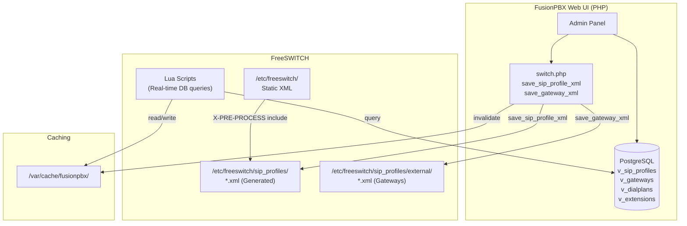
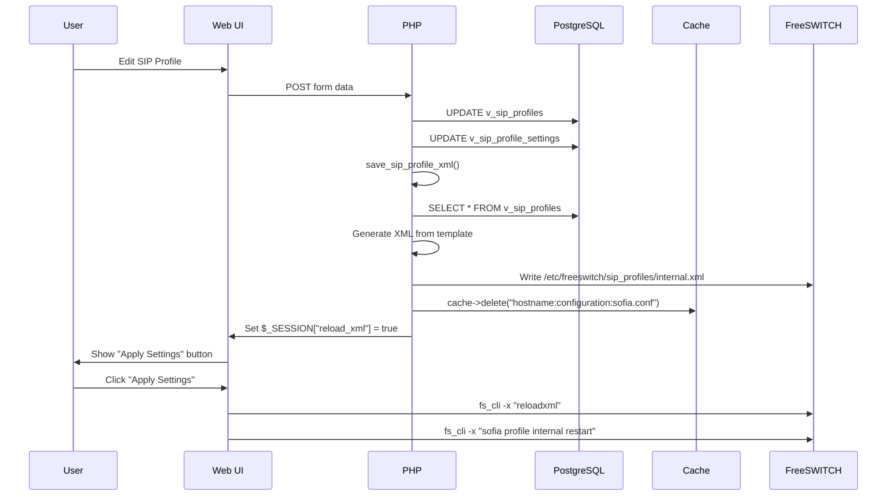

# FusionPBX Configuration Generation System

> How FusionPBX dynamically generates FreeSWITCH configurations from the database.

This document explains the architecture behind FusionPBX's configuration management - the key to understanding how to build a similar system.

---

## Table of Contents
1. [Architecture Overview](#architecture-overview)
2. [The Central Config File](#the-central-config-file)
3. [SIP Profile Generation](#sip-profile-generation)
4. [Gateway Generation](#gateway-generation)
5. [Database Schema](#database-schema)
6. [XML Template System](#xml-template-system)
7. [Cache System](#cache-system)
8. [Lua Scripts for Real-Time Queries](#lua-scripts-for-real-time-queries)
9. [The Complete Flow](#the-complete-flow)
10. [Replicating This Architecture](#replicating-this-architecture)

---

## Architecture Overview

FusionPBX uses a **hybrid approach** for FreeSWITCH configuration:

| Method | Used For | How It Works |
|--------|----------|--------------|
| **Static XML** | Base configs | Installed during setup in `/etc/freeswitch/` |
| **Generated XML** | SIP profiles, gateways, call center | PHP reads DB → generates XML files |
| **Lua Real-time** | Dialplan, directory, IVR | Lua queries DB during call processing |
| **Cache Layer** | Performance | File cache + FreeSWITCH memcache |



---

## The Central Config File

**Location:** `/etc/fusionpbx/config.conf`

This is the **single source of truth** that both PHP and Lua scripts use for database credentials and paths:

```ini
# Database: PostgreSQL connection for the PHP application
database.0.type = pgsql
database.0.host = 127.0.0.1
database.0.port = 5432
database.0.name = fusionpbx
database.0.username = fusionpbx
database.0.password = YOUR_PASSWORD

# Database: FreeSWITCH Lua scripts connection (can be same or different)
database.1.type = pgsql
database.1.host = 127.0.0.1
database.1.port = 5432
database.1.name = fusionpbx
database.1.username = fusionpbx
database.1.password = YOUR_PASSWORD

# Switch directories
switch.conf.dir = /etc/freeswitch
switch.sounds.dir = /usr/share/freeswitch/sounds
switch.database.dir = /var/lib/freeswitch/db
switch.recordings.dir = /var/lib/freeswitch/recordings
switch.storage.dir = /var/lib/freeswitch/storage
switch.voicemail.dir = /var/lib/freeswitch/storage/voicemail
switch.scripts.dir = /usr/share/freeswitch/scripts

# Event Socket for PHP to communicate with FreeSWITCH
switch.event_socket.host = 127.0.0.1
switch.event_socket.port = 8021
switch.event_socket.password = ClueCon

# Cache settings
cache.method = file
cache.location = /var/cache/fusionpbx
```

---

## SIP Profile Generation

### The Function: `save_sip_profile_xml()`

**Location:** [/var/www/fusionpbx/resources/switch.php](https://github.com/fusionpbx/fusionpbx/blob/master/resources/switch.php)

This function reads SIP profiles from the database and generates XML files:

```php
function save_sip_profile_xml() {
    global $database, $settings;
    
    // Skip if directory not set
    if (empty($settings->get('switch', 'sip_profiles'))) {
        return;
    }
    
    // Create profile directory if needed
    $profile_dir = $settings->get('switch', 'conf')."/sip_profiles";
    if (!is_readable($profile_dir)) {
        mkdir($profile_dir, 0770, false);
    }
    
    // Query all SIP profiles from database
    $sql = "select * from v_sip_profiles";
    $result = $database->select($sql, null, 'all');
    
    foreach($result as $row) {
        $sip_profile_uuid = $row['sip_profile_uuid'];
        $sip_profile_name = $row['sip_profile_name'];
        $sip_profile_enabled = $row['sip_profile_enabled'];
        
        // Skip disabled profiles (create empty file)
        if (!$sip_profile_enabled) {
            $fout = fopen($profile_dir.'/'.$sip_profile_name.".xml", "w");
            fclose($fout);
            continue;
        }
        
        // Load the appropriate XML template
        if ($sip_profile_name == "internal" || 
            $sip_profile_name == "external" || 
            $sip_profile_name == "internal-ipv6") {
            $file_contents = file_get_contents(
                dirname(__DIR__, 1)."/app/sip_profiles/resources/xml/sip_profiles/"
                .$sip_profile_name.".xml"
            );
        } else {
            $file_contents = file_get_contents(
                dirname(__DIR__, 1)."/app/sip_profiles/resources/xml/sip_profiles/default.xml"
            );
        }
        
        // Query profile settings from database
        $sql = "select * from v_sip_profile_settings ";
        $sql .= "where sip_profile_uuid = :sip_profile_uuid ";
        $sql .= "and sip_profile_setting_enabled = true ";
        $parameters['sip_profile_uuid'] = $sip_profile_uuid;
        $result_2 = $database->select($sql, $parameters, 'all');
        
        // Build settings XML string
        $sip_profile_settings = '';
        foreach ($result_2 as $row_2) {
            $sip_profile_settings .= "\t\t<param name=\""
                .$row_2["sip_profile_setting_name"]."\" value=\""
                .$row_2["sip_profile_setting_value"]."\"/>\n";
        }
        
        // Replace placeholders in template
        $file_contents = str_replace("{v_sip_profile_name}", $sip_profile_name, $file_contents);
        $file_contents = str_replace("{v_sip_profile_settings}", $sip_profile_settings, $file_contents);
        
        // Write the generated XML to /etc/freeswitch/sip_profiles/
        $fout = fopen($profile_dir.'/'.$sip_profile_name.".xml", "w");
        fwrite($fout, $file_contents);
        fclose($fout);
        
        // Create subdirectory for gateways (e.g., /etc/freeswitch/sip_profiles/internal/)
        if (!is_readable($profile_dir.'/'.$sip_profile_name)) {
            mkdir($profile_dir.'/'.$sip_profile_name, 0770, false);
        }
    }
    
    // Signal that XML needs to be reloaded
    $_SESSION["reload_xml"] = true;
}
```

---

## Gateway Generation

### The Function: `save_gateway_xml()`

Gateways (SIP trunks) are saved as individual XML files inside the profile directory:

```php
function save_gateway_xml() {
    global $database, $settings, $domain_uuid;
    
    // Skip if directory not set
    if (empty($settings->get('switch', 'sip_profiles'))) {
        return;
    }
    
    // Delete all old gateway files first (they have v_ prefix)
    if (count($_SESSION["domains"]) > 1) {
        $v_needle = 'v_'.$_SESSION['domain_name'].'-';
    } else {
        $v_needle = 'v_';
    }
    $gateway_list = glob($settings->get('switch', 'sip_profiles') . "/*/".$v_needle."*.xml");
    foreach ($gateway_list as $gateway_file) {
        unlink($gateway_file);
    }
    
    // Query gateways from database
    $sql = "select * from v_gateways ";
    $sql .= "where (domain_uuid = :domain_uuid or domain_uuid is null) ";
    $parameters['domain_uuid'] = $domain_uuid;
    $result = $database->select($sql, $parameters, 'all');
    
    foreach ($result as $row) {
        if ($row['enabled'] != "false") {
            // Default profile is "external"
            $profile = $row['profile'] ?: "external";
            
            // Build gateway XML
            $xml = "<include>\n";
            $xml .= "    <gateway name=\"" . strtolower($row['gateway_uuid']) . "\">\n";
            
            if (!empty($row['username'])) {
                $xml .= "      <param name=\"username\" value=\"" . $row['username'] . "\"/>\n";
            }
            if (!empty($row['password'])) {
                $xml .= "      <param name=\"password\" value=\"" . $row['password'] . "\"/>\n";
            }
            if (!empty($row['proxy'])) {
                $xml .= "      <param name=\"proxy\" value=\"" . $row['proxy'] . "\"/>\n";
            }
            if (!empty($row['register'])) {
                $xml .= "      <param name=\"register\" value=\"" . $row['register'] . "\"/>\n";
            }
            // ... more parameters
            
            $xml .= "    </gateway>\n";
            $xml .= "</include>";
            
            // Write to /etc/freeswitch/sip_profiles/external/v_<uuid>.xml
            $fout = fopen(
                $settings->get('switch', 'sip_profiles')."/".$profile."/v_".strtolower($row['gateway_uuid']).".xml",
                "w"
            );
            fwrite($fout, $xml);
            fclose($fout);
        }
    }
    
    $_SESSION["reload_xml"] = true;
}
```

---

## Database Schema

### `v_sip_profiles` - SIP Profile Definitions

```sql
CREATE TABLE v_sip_profiles (
    sip_profile_uuid UUID PRIMARY KEY,
    sip_profile_name VARCHAR(255),           -- 'internal', 'external', 'custom'
    sip_profile_hostname VARCHAR(255),       -- for multi-server clusters
    sip_profile_enabled VARCHAR(8),          -- 'true' or 'false'
    sip_profile_description TEXT
);
```

### `v_sip_profile_settings` - Profile Parameters

```sql
CREATE TABLE v_sip_profile_settings (
    sip_profile_setting_uuid UUID PRIMARY KEY,
    sip_profile_uuid UUID REFERENCES v_sip_profiles,
    sip_profile_setting_name VARCHAR(255),   -- 'sip-port', 'rtp-ip', 'context'
    sip_profile_setting_value VARCHAR(255),  -- '5060', '$${local_ip_v4}', 'public'
    sip_profile_setting_enabled VARCHAR(8)   -- 'true' or 'false'
);
```

### `v_sip_profile_domains` - Domain Mappings

```sql
CREATE TABLE v_sip_profile_domains (
    sip_profile_domain_uuid UUID PRIMARY KEY,
    sip_profile_uuid UUID,
    sip_profile_domain_name VARCHAR(255),    -- 'all', '$${domain}', 'example.com'
    sip_profile_domain_alias VARCHAR(8),     -- 'true' or 'false'
    sip_profile_domain_parse VARCHAR(8)      -- 'true' or 'false'
);
```

### `v_gateways` - SIP Trunks

```sql
CREATE TABLE v_gateways (
    gateway_uuid UUID PRIMARY KEY,
    domain_uuid UUID,                        -- which tenant owns this
    gateway VARCHAR(255),                    -- gateway name
    username VARCHAR(255),
    password VARCHAR(255),
    from_user VARCHAR(255),
    from_domain VARCHAR(255),
    proxy VARCHAR(255),
    realm VARCHAR(255),
    register VARCHAR(8),                     -- 'true' or 'false'
    register_transport VARCHAR(16),          -- 'udp', 'tcp', 'tls'
    expire_seconds INTEGER,
    retry_seconds INTEGER,
    context VARCHAR(255),                    -- dialplan context
    profile VARCHAR(255),                    -- 'external', 'internal'
    enabled VARCHAR(8)
);
```

---

## XML Template System

Templates are stored in `/var/www/fusionpbx/app/sip_profiles/resources/xml/sip_profiles/`:

### internal.xml (template)

```xml
<profile name="{v_sip_profile_name}">
    <domains>
        <domain name="all" alias="true" parse="true"/>
    </domains>
    <settings>
{v_sip_profile_settings}
    </settings>
</profile>
```

### Generated output: `/etc/freeswitch/sip_profiles/internal.xml`

```xml
<profile name="internal">
    <domains>
        <domain name="all" alias="true" parse="true"/>
    </domains>
    <settings>
        <param name="sip-ip" value="$${local_ip_v4}"/>
        <param name="sip-port" value="5060"/>
        <param name="rtp-ip" value="$${local_ip_v4}"/>
        <param name="ext-sip-ip" value="auto-nat"/>
        <param name="ext-rtp-ip" value="auto-nat"/>
        <param name="context" value="public"/>
        <param name="inbound-codec-prefs" value="$${global_codec_prefs}"/>
        <param name="outbound-codec-prefs" value="$${global_codec_prefs}"/>
        <!-- ... more settings from database ... -->
    </settings>
</profile>
```

---

## Cache System

FusionPBX uses a file-based cache at `/var/cache/fusionpbx/`:

### PHP Cache Class

**Location:** [/var/www/fusionpbx/resources/classes/cache.php](https://github.com/fusionpbx/fusionpbx/blob/master/resources/classes/cache.php)

```php
class cache {
    private $location = '/var/cache/fusionpbx';
    private $method = 'file';
    
    public function get($key) {
        $key = str_replace(":", ".", $key);
        if (file_exists($this->location . "/" . $key)) {
            return file_get_contents($this->location . "/" . $key);
        }
        return null;
    }
    
    public function set($key, $value) {
        $key = str_replace(":", ".", $key);
        return file_put_contents($this->location . "/" . $key, $value);
    }
    
    public function delete($key) {
        // Send event to FreeSWITCH memcache for cluster sync
        $event = "sendevent CUSTOM\n";
        $event .= "Event-Name: CUSTOM\n";
        $event .= "Event-Subclass: fusion::memcache\n";
        $event .= "API-Command: memcache\n";
        $event .= "API-Command-Argument: delete " . $key . "\n";
        event_socket::command($event);
        
        // Also run memcache delete locally
        $command = "memcache delete " . $key;
        event_socket::api($command);
    }
}
```

### Cache Key Naming Convention

| Key Pattern | Purpose |
|-------------|---------|
| `hostname:configuration:sofia.conf` | Sofia/SIP profile config |
| `hostname:dialplan:context-name` | Cached dialplan XML |
| `hostname:directory:domain-name` | Cached user directory |
| `hostname:acl:acl-name` | Access control lists |

---

## Lua Scripts for Real-Time Queries

For **dialplan** and **directory** lookups, FusionPBX uses Lua scripts that query the database at call time.

### config.lua - Database Connection

**Location:** [app/switch/resources/scripts/resources/functions/config.lua](https://github.com/fusionpbx/fusionpbx/blob/master/app/switch/resources/scripts/resources/functions/config.lua)

```lua
function config()
    -- Find config file location
    if file_exists("/usr/local/etc/fusionpbx/config.conf") then
        return "/usr/local/etc/fusionpbx/config.conf"
    elseif file_exists("/etc/fusionpbx/config.conf") then
        return "/etc/fusionpbx/config.conf"
    end
end

function load_config()
    config_file = config()
    
    -- Initialize arrays
    database = {}
    database.system = {}
    database.switch = {}
    
    -- Read config file
    file = io.open(config_file)
    for line in file:lines() do
        if string.match(line, "=") then
            k, v = parse_line(line)
            
            -- Database system settings
            if k == "database.0.type" then database.system.type = v end
            if k == "database.0.host" then database.system.host = v end
            if k == "database.0.port" then database.system.port = v end
            if k == "database.0.name" then database.system.name = v end
            if k == "database.0.username" then database.system.username = v end
            if k == "database.0.password" then database.system.password = v end
            
            -- Switch directories
            if k == "switch.conf.dir" then conf_dir = v end
            if k == "switch.sounds.dir" then sounds_dir = v end
            if k == "switch.scripts.dir" then scripts_dir = v end
            
            -- Cache settings
            if k == "cache.method" then cache.method = v end
            if k == "cache.location" then cache.location = v end
        end
    end
    io.close(file)
    
    -- Build PostgreSQL DSN string
    database.system = "pgsql://host=" .. database.system.host 
        .. " port=" .. database.system.port 
        .. " dbname=" .. database.system.name 
        .. " user=" .. database.system.username 
        .. " password=" .. database.system.password
end

-- Auto-load on script include
load_config()
```

### database.lua - Query Execution

**Location:** [app/switch/resources/scripts/resources/functions/database.lua](https://github.com/fusionpbx/fusionpbx/blob/master/app/switch/resources/scripts/resources/functions/database.lua)

```lua
require 'resources.functions.config'

function Database.new(dsn_name)
    local dsn = dsn_name == "system" and database.system or database.switch
    
    -- Connect to PostgreSQL
    local dbh = freeswitch.Dbh(dsn)
    
    return dbh
end

function Database:query(sql, params, callback)
    -- Substitute named parameters
    if params then
        for param, value in pairs(params) do
            sql = sql:gsub(":" .. param, self:quote(value))
        end
    end
    
    -- Execute query with callback
    return self:query(sql, callback)
end

function Database:first_value(sql, params)
    local result
    self:query(sql, params, function(row)
        local k, v = next(row)
        result = v
        return 1  -- stop after first row
    end)
    return result
end
```

---

## The Complete Flow

### When User Edits SIP Profile in Web UI:



---

## Replicating This Architecture

To build a similar system for your own PBX UI:

### 1. Database Design

Create tables for storing configurations:

```sql
-- Your equivalent tables
CREATE TABLE sip_profiles (
    id UUID PRIMARY KEY,
    name VARCHAR(255) NOT NULL,
    enabled BOOLEAN DEFAULT true,
    created_at TIMESTAMP DEFAULT NOW()
);

CREATE TABLE sip_profile_settings (
    id UUID PRIMARY KEY,
    profile_id UUID REFERENCES sip_profiles(id),
    name VARCHAR(255) NOT NULL,
    value VARCHAR(255),
    enabled BOOLEAN DEFAULT true
);

CREATE TABLE gateways (
    id UUID PRIMARY KEY,
    tenant_id UUID,
    name VARCHAR(255),
    username VARCHAR(255),
    password VARCHAR(255),
    host VARCHAR(255),
    port INTEGER DEFAULT 5060,
    register BOOLEAN DEFAULT true,
    profile VARCHAR(255) DEFAULT 'external',
    enabled BOOLEAN DEFAULT true
);
```

### 2. XML Template Files

Create template files with placeholders:

```xml
<!-- templates/sip_profiles/internal.xml -->
<profile name="{{profile_name}}">
    <domains>
        <domain name="all" alias="true" parse="true"/>
    </domains>
    <settings>
{{#each settings}}
        <param name="{{name}}" value="{{value}}"/>
{{/each}}
    </settings>
</profile>
```

### 3. Configuration Generator (Node.js/PHP/Python)

```javascript
// Example in JavaScript
async function generateSipProfileXml(profileId) {
    const profile = await db.query('SELECT * FROM sip_profiles WHERE id = $1', [profileId]);
    const settings = await db.query(
        'SELECT * FROM sip_profile_settings WHERE profile_id = $1 AND enabled = true', 
        [profileId]
    );
    
    // Load template
    const template = fs.readFileSync(`templates/sip_profiles/${profile.name}.xml`, 'utf8');
    
    // Render template
    const xml = Mustache.render(template, {
        profile_name: profile.name,
        settings: settings.rows
    });
    
    // Write to FreeSWITCH config directory
    fs.writeFileSync(`/etc/freeswitch/sip_profiles/${profile.name}.xml`, xml);
    
    // Invalidate cache
    await cache.delete(`configuration:sofia.conf`);
    
    // Signal reload needed
    return { needsReload: true };
}
```

### 4. FreeSWITCH Reload API

```javascript
// Send reload command via Event Socket
const esl = require('esl');

async function reloadFreeSwitchXml() {
    const conn = await esl.connect('127.0.0.1', 8021, 'ClueCon');
    await conn.api('reloadxml');
    conn.disconnect();
}

async function restartSofiaProfile(profileName) {
    const conn = await esl.connect('127.0.0.1', 8021, 'ClueCon');
    await conn.api(`sofia profile ${profileName} restart`);
    conn.disconnect();
}
```

### 5. Real-Time Lua Scripts (Optional)

For dynamic dialplan/directory:

```lua
-- /usr/share/freeswitch/scripts/directory.lua
require "resources.functions.config"
require "resources.functions.database"

local db = Database.new("system")
local username = session:getVariable("user")
local domain = session:getVariable("domain")

local sql = [[
    SELECT password, voicemail_id, user_context 
    FROM extensions 
    WHERE username = :username AND domain = :domain
]]

db:query(sql, {username = username, domain = domain}, function(row)
    session:setVariable("password", row.password)
    session:setVariable("voicemail_id", row.voicemail_id)
    session:setVariable("user_context", row.user_context)
end)

db:release()
```

---

## Why Your Installation Shows Empty SIP Profiles

If `/etc/freeswitch/sip_profiles/` contains only:
- `empty.xml` - A placeholder
- `*.xml.noload` - Template files (not loaded)

The **actual** profile files (`internal.xml`, `external.xml`) are **generated on-demand** by `save_sip_profile_xml()`. They're created:

1. During initial install via `upgrade.php --defaults`
2. When you edit profiles in the web UI
3. When you run the upgrade process

### To Manually Regenerate:

```bash
cd /var/www/fusionpbx
php core/upgrade/upgrade.php --defaults
```

Or via FusionPBX UI: **Advanced → Upgrade → Execute**

---

## Key Takeaways

1. **Database is the source of truth** - All config lives in PostgreSQL, not XML files
2. **XML files are generated artifacts** - Never edit them directly, they're overwritten
3. **Templates + Database = Generated XML** - Simple but effective pattern
4. **Cache invalidation is critical** - Always clear cache after DB changes
5. **Event Socket for signaling** - Tell FreeSWITCH to reload after changes
6. **Lua for real-time** - Complex dialplan/directory queries happen at call time
