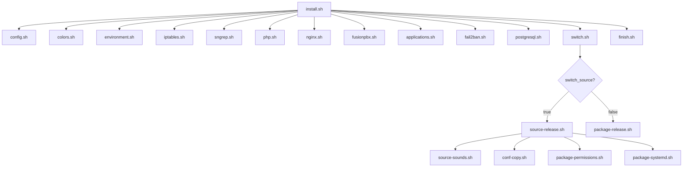
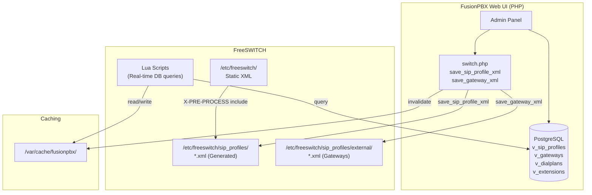

# FusionPBX Debian Install Script Documentation

> **Source**: [fusionpbx/fusionpbx-install.sh](https://github.com/fusionpbx/fusionpbx-install.sh/tree/master/debian)

This document provides a comprehensive breakdown of the FusionPBX Debian installation script architecture to help you reverse engineer and customize the installation process.

---

## Table of Contents
1. [Overview](#overview)
2. [Directory Structure](#directory-structure)
3. [Configuration Variables](#configuration-variables)
4. [Installation Flow](#installation-flow)
5. [Component Scripts](#component-scripts)
6. [Key Customization Points](#key-customization-points)

---

## Overview

The FusionPBX install script is a modular shell-based installer that:
- Installs and configures **FreeSWITCH** (via source compilation or package)
- Sets up **NGINX** as the web server with PHP-FPM
- Configures **PostgreSQL** as the database
- Deploys the **FusionPBX** PHP application
- Configures security with **IPTables** and **Fail2Ban**
- Creates initial admin user and domain



---

## Directory Structure

```
debian/
├── install.sh                    # Main entry point
└── resources/
    ├── config.sh                 # Configuration variables
    ├── colors.sh                 # Terminal color helpers
    ├── environment.sh            # CPU/OS detection
    ├── iptables.sh               # Firewall configuration
    ├── sngrep.sh                 # SIP packet capture tool
    ├── php.sh                    # PHP installation
    ├── nginx.sh                  # Web server setup
    ├── fusionpbx.sh              # FusionPBX app deployment
    ├── applications.sh           # Optional apps (transcribe, speech, etc.)
    ├── fail2ban.sh               # Intrusion prevention
    ├── postgresql.sh             # Database setup
    ├── finish.sh                 # Final configuration & user creation
    ├── nginx/
    │   └── fusionpbx             # NGINX vhost config
    ├── fail2ban/
    │   ├── freeswitch.conf       # Fail2ban filters
    │   ├── fusionpbx.conf
    │   └── jail.local            # Jail definitions
    ├── fusionpbx/
    │   └── config.conf           # FusionPBX config template
    ├── backup/
    │   ├── fusionpbx-backup      # Backup cron script
    │   └── fusionpbx-maintenance # Maintenance cron script
    └── switch/
        ├── source-release.sh     # Compile FreeSWITCH from source
        ├── source-master.sh      # Compile master branch
        ├── source-sounds.sh      # Install sound/MOH files
        ├── conf-copy.sh          # Copy config to /etc/freeswitch
        ├── package-release.sh    # Install via package
        ├── package-permissions.sh# Set file permissions
        └── package-systemd.sh    # Create systemd service
```

---

## Configuration Variables

All configurable options are in `resources/config.sh`:

### FusionPBX Settings
| Variable | Default | Description |
|----------|---------|-------------|
| `domain_name` | `ip_address` | Domain: `hostname`, `ip_address`, or custom value |
| `system_username` | `admin` | Initial admin username |
| `system_password` | `random` | `random` or custom password |
| `system_branch` | `5.4` | FusionPBX version: `master`, `5.4` |

### FreeSWITCH Settings
| Variable | Default | Description |
|----------|---------|-------------|
| `switch_branch` | `stable` | `master` or `stable` |
| `switch_source` | `true` | Compile from source |
| `switch_package` | `false` | Install from binary package |
| `switch_version` | `1.10.12` | Source version to download |
| `switch_tls` | `true` | Enable TLS support |
| `switch_token` | | SignalWire auth token (for packages) |
| `sofia_version` | `1.13.17` | Sofia-SIP library version |

### Database Settings
| Variable | Default | Description |
|----------|---------|-------------|
| `database_name` | `fusionpbx` | PostgreSQL database name |
| `database_username` | `fusionpbx` | Database username |
| `database_password` | `random` | `random` or custom |
| `database_repo` | `official` | `official` or `system` repo |
| `database_version` | `18` | PostgreSQL version |
| `database_host` | `127.0.0.1` | Database host |
| `database_port` | `5432` | Database port |

### General Settings
| Variable | Default | Description |
|----------|---------|-------------|
| `php_version` | `8.2` | PHP version: 8.1, 8.2, 8.3 |
| `letsencrypt_folder` | `true` | Create Let's Encrypt webroot |

### Optional Applications
| Variable | Default | Description |
|----------|---------|-------------|
| `application_transcribe` | `true` | Speech-to-Text app |
| `application_speech` | `true` | Text-to-Speech app |
| `application_device_logs` | `true` | Device provisioning logs |
| `application_dialplan_tools` | `false` | Additional dialplan apps |
| `application_edit` | `false` | XML/PHP editor |
| `application_sip_trunks` | `false` | Registration-based SIP trunks |

---

## Installation Flow

### Phase 1: Main Script (`install.sh`)

```bash
#!/bin/sh
cd "$(dirname "$0")"

# Load configuration and helpers
. ./resources/config.sh
. ./resources/colors.sh
. ./resources/environment.sh

# Remove CD-ROM from apt sources
sed -i '/cdrom:/d' /etc/apt/sources.list

# Update system
apt-get update && apt-get upgrade -y

# Install base dependencies
apt-get install -y wget lsb-release systemd systemd-sysv \
    ca-certificates dialog nano net-tools gpg

# Install SNMP
apt-get install -y snmpd
echo "rocommunity public" > /etc/snmp/snmpd.conf
service snmpd restart

# Disable vi visual mode
echo "set mouse-=a" >> ~/.vimrc

# Execute component scripts in order:
resources/iptables.sh      # 1. Firewall
resources/sngrep.sh        # 2. SIP debugging tool
resources/php.sh           # 3. PHP + NGINX
resources/nginx.sh         # 4. NGINX config
resources/fusionpbx.sh     # 5. Clone FusionPBX
resources/applications.sh  # 6. Optional apps
resources/fail2ban.sh      # 7. Intrusion prevention
resources/postgresql.sh    # 8. Database
resources/switch.sh        # 9. FreeSWITCH
resources/finish.sh        # 10. Final setup
```

---

### Phase 2: Environment Detection (`environment.sh`)

Detects CPU architecture and OS version:

```bash
os_name=$(lsb_release -is)      # e.g., "Debian"
os_codename=$(lsb_release -cs)  # e.g., "bookworm"
cpu_name=$(uname -m)            # e.g., "x86_64"
cpu_architecture='x86'          # 'x86' or 'arm'
```

**Supported Platforms:**
- Debian: jessie, stretch, buster, bullseye, bookworm, trixie
- CPU: x86_64 (64-bit), armv7l, aarch64

---

### Phase 3: IPTables Firewall (`iptables.sh`)

```bash
# Switch to iptables-legacy (Debian >= buster uses nftables)
update-alternatives --set iptables /usr/sbin/iptables-legacy
update-alternatives --set ip6tables /usr/sbin/ip6tables-legacy

# Remove UFW
ufw reset && ufw disable
apt-get remove -y ufw

# Flush existing rules
iptables -F

# Block SIP attack patterns
iptables -A INPUT -j DROP -p udp --dport 5060:5091 \
    -m string --string "friendly-scanner" --algo bm --icase
iptables -A INPUT -j DROP -p udp --dport 5060:5091 \
    -m string --string "sipcli/" --algo bm --icase
# ... more attack patterns

# Allow essential ports
iptables -A INPUT -p tcp --dport 22 -j ACCEPT      # SSH
iptables -A INPUT -p tcp --dport 80 -j ACCEPT      # HTTP
iptables -A INPUT -p tcp --dport 443 -j ACCEPT     # HTTPS
iptables -A INPUT -p tcp --dport 7443 -j ACCEPT    # WSS
iptables -A INPUT -p tcp --dport 5060:5091 -j ACCEPT  # SIP TCP
iptables -A INPUT -p udp --dport 5060:5091 -j ACCEPT  # SIP UDP
iptables -A INPUT -p udp --dport 16384:32768 -j ACCEPT # RTP

# QoS marking
iptables -t mangle -A OUTPUT -p udp --sport 16384:32768 -j DSCP --set-dscp 46
iptables -t mangle -A OUTPUT -p udp --sport 5060:5091 -j DSCP --set-dscp 26

# Default policies
iptables -P INPUT DROP
iptables -P FORWARD DROP
iptables -P OUTPUT ACCEPT

# Persist rules
apt-get install -y iptables-persistent
```

---

### Phase 4: PHP Installation (`php.sh`)

```bash
# Add Sury PHP repository for newer PHP versions
wget -qO- https://packages.sury.org/php/apt.gpg | gpg --dearmor > /etc/apt/keyrings/sury-php-8.x.gpg
echo "deb [signed-by=/etc/apt/keyrings/sury-php-8.x.gpg] https://packages.sury.org/php/ $(lsb_release -sc) main" \
    > /etc/apt/sources.list.d/php.list

# Install PHP with extensions
apt-get install -y php8.2 php8.2-common php8.2-cli php8.2-dev \
    php8.2-fpm php8.2-pgsql php8.2-sqlite3 php8.2-odbc \
    php8.2-curl php8.2-imap php8.2-xml php8.2-gd \
    php8.2-mbstring php8.2-ldap php8.2-inotify php8.2-snmp

# Configure PHP
php_ini_file='/etc/php/8.2/fpm/php.ini'
sed 's#post_max_size = .*#post_max_size = 80M#g' -i $php_ini_file
sed 's#upload_max_filesize = .*#upload_max_filesize = 80M#g' -i $php_ini_file
sed 's#;max_input_vars = .*#max_input_vars = 8000#g' -i $php_ini_file

# Install ionCube (x86 only)
. ./ioncube.sh

systemctl restart php8.2-fpm
```

---

### Phase 5: NGINX Configuration (`nginx.sh`)

```bash
# Copy FusionPBX NGINX config
cp nginx/fusionpbx /etc/nginx/sites-available/fusionpbx

# Update PHP-FPM socket path
sed -i /etc/nginx/sites-available/fusionpbx \
    -e 's#unix:.*;#unix:/var/run/php/php8.2-fpm.sock;#g'

# Enable site
ln -s /etc/nginx/sites-available/fusionpbx /etc/nginx/sites-enabled/fusionpbx

# Self-signed SSL certificate (snake oil)
ln -s /etc/ssl/private/ssl-cert-snakeoil.key /etc/ssl/private/nginx.key
ln -s /etc/ssl/certs/ssl-cert-snakeoil.pem /etc/ssl/certs/nginx.crt

# Remove default site
rm /etc/nginx/sites-enabled/default

# Create Let's Encrypt webroot
mkdir -p /var/www/letsencrypt/

systemctl restart nginx
```

---

### Phase 6: FusionPBX Deployment (`fusionpbx.sh`)

```bash
# Install dependencies
apt-get install -y vim git dbus haveged ssl-cert qrencode
apt-get install -y ghostscript libtiff5-dev libtiff-tools at

# Create cache directory
mkdir -p /var/cache/fusionpbx
chown -R www-data:www-data /var/cache/fusionpbx

# Clone FusionPBX repository
git clone -b 5.4 https://github.com/fusionpbx/fusionpbx.git /var/www/fusionpbx
chown -R www-data:www-data /var/www/fusionpbx
```

---

### Phase 7: Optional Applications (`applications.sh`)

```bash
cd /var/www/fusionpbx/app

# Clone optional apps based on config.sh settings
if [ .$application_transcribe = .'true' ]; then
    git clone https://github.com/fusionpbx/fusionpbx-app-transcribe.git transcribe
fi
if [ .$application_speech = .'true' ]; then
    git clone https://github.com/fusionpbx/fusionpbx-app-speech.git speech
fi
if [ .$application_device_logs = .'true' ]; then
    git clone https://github.com/fusionpbx/fusionpbx-app-device_logs.git device_logs
fi
# ... etc

chown -R www-data:www-data /var/www/fusionpbx
```

---

### Phase 8: PostgreSQL Setup (`postgresql.sh`)

```bash
# Generate random password
password=$(dd if=/dev/urandom bs=1 count=20 2>/dev/null | base64)

# Add PostgreSQL official repository
sh -c 'echo "deb [signed-by=/etc/apt/keyrings/pgdg.gpg] \
    http://apt.postgresql.org/pub/repos/apt $(lsb_release -cs)-pgdg main" \
    > /etc/apt/sources.list.d/pgdg.list'
wget -O - https://www.postgresql.org/media/keys/ACCC4CF8.asc | gpg --dearmor -o /etc/apt/keyrings/pgdg.gpg

apt-get update
apt-get install -y postgresql-18

# Initialize cluster
pg_createcluster 18 main

# Switch from scram-sha-256 to md5 (for FusionPBX compatibility)
sed -i /etc/postgresql/18/main/pg_hba.conf -e '/^#/!s/scram-sha-256/md5/g'

systemctl restart postgresql

# Create database and user
sudo -u postgres psql -c "CREATE DATABASE fusionpbx;"
sudo -u postgres psql -c "CREATE ROLE fusionpbx WITH SUPERUSER LOGIN PASSWORD '$password';"
sudo -u postgres psql -c "GRANT ALL PRIVILEGES ON DATABASE fusionpbx to fusionpbx;"
```

---

### Phase 9: FreeSWITCH Installation (`switch.sh`)

The switch installation branches based on `switch_source` and `switch_package`:

```bash
if [ .$switch_source = .true ]; then
    # Compile from source
    switch/source-release.sh    # or source-master.sh
    switch/source-sounds.sh     # Install sounds/MOH
    switch/conf-copy.sh         # Copy config
    switch/package-permissions.sh
    switch/package-systemd.sh
fi

if [ .$switch_package = .true ]; then
    # Install from binary package
    switch/package-release.sh
    switch/conf-copy.sh
    switch/package-permissions.sh
    switch/package-systemd.sh
fi
```

#### Source Compilation (`source-release.sh`)

```bash
# Install build dependencies
apt install -y autoconf automake devscripts g++ git-core \
    libncurses5-dev libtool make libjpeg-dev pkg-config \
    libpq-dev liblua5.2-dev libsqlite3-dev libpcre3-dev ...

# Build libks (SignalWire library)
cd /usr/src
git clone https://github.com/signalwire/libks.git
cd libks && cmake . && make -j $(nproc) && make install

# Build Sofia-SIP
cd /usr/src
wget https://github.com/freeswitch/sofia-sip/archive/refs/tags/v1.13.17.zip
unzip v1.13.17.zip && cd sofia-sip-1.13.17
sh autogen.sh && ./configure && make -j $(nproc) && make install

# Build SpanDSP
cd /usr/src
git clone https://github.com/freeswitch/spandsp.git
cd spandsp && sh autogen.sh && ./configure && make -j $(nproc) && make install

# Clone FreeSWITCH
cd /usr/src
git clone https://github.com/fusionpbx/freeswitch freeswitch-1.10.12
cd freeswitch-1.10.12 && ./bootstrap.sh -j

# Enable additional modules in modules.conf
sed -i modules.conf -e s:'#applications/mod_callcenter:applications/mod_callcenter:'
sed -i modules.conf -e s:'#applications/mod_cidlookup:applications/mod_cidlookup:'
sed -i modules.conf -e s:'#formats/mod_shout:formats/mod_shout:'
# ... more modules

# Disable problematic modules
sed -i modules.conf -e s:'applications/mod_signalwire:#applications/mod_signalwire:'
sed -i modules.conf -e s:'endpoints/mod_verto:#endpoints/mod_verto:'

# Configure and compile
./configure -C --enable-portable-binary --enable-debug \
    --prefix=/usr --localstatedir=/var --sysconfdir=/etc \
    --with-openssl --enable-core-pgsql-support

make -j $(nproc)
make install
```

#### Sound Files (`source-sounds.sh`)

```bash
cd /usr/src/freeswitch-1.10.12

# Install sounds at various sample rates
make sounds-install moh-install
make hd-sounds-install hd-moh-install
make cd-sounds-install cd-moh-install

# Organize music-on-hold files
mkdir -p /usr/share/freeswitch/sounds/music/default
mv /usr/share/freeswitch/sounds/music/*000 /usr/share/freeswitch/sounds/music/default
```

#### Configuration Copy (`conf-copy.sh`)

```bash
# Backup original config
mv /etc/freeswitch /etc/freeswitch.orig

# Copy FusionPBX-specific config
mkdir /etc/freeswitch
cp -R /var/www/fusionpbx/app/switch/resources/conf/* /etc/freeswitch
```

---

### Phase 10: Fail2Ban Security (`fail2ban.sh`)

```bash
apt-get install -y fail2ban rsyslog

# Copy filter definitions
cp fail2ban/freeswitch.conf /etc/fail2ban/filter.d/
cp fail2ban/freeswitch-acl.conf /etc/fail2ban/filter.d/
cp fail2ban/sip-auth-failure.conf /etc/fail2ban/filter.d/
cp fail2ban/fusionpbx.conf /etc/fail2ban/filter.d/
cp fail2ban/nginx-404.conf /etc/fail2ban/filter.d/
cp fail2ban/nginx-dos.conf /etc/fail2ban/filter.d/
cp fail2ban/jail.local /etc/fail2ban/jail.local

service fail2ban restart
```

---

### Phase 11: Final Setup (`finish.sh`)

```bash
# Generate database password
if [ .$database_password = .'random' ]; then
    database_password=$(dd if=/dev/urandom bs=1 count=20 2>/dev/null | base64)
fi

# Update PostgreSQL passwords
sudo -u postgres psql -c "ALTER USER fusionpbx WITH PASSWORD '$database_password';"
sudo -u postgres psql -c "ALTER USER freeswitch WITH PASSWORD '$database_password';"

# Install backup cron jobs
cp backup/fusionpbx-backup /etc/cron.daily
cp backup/fusionpbx-maintenance /etc/cron.daily
chmod 755 /etc/cron.daily/fusionpbx-*
sed -i "s/zzz/$database_password/g" /etc/cron.daily/fusionpbx-*

# Create FusionPBX config
mkdir -p /etc/fusionpbx
cp fusionpbx/config.conf /etc/fusionpbx
sed -i /etc/fusionpbx/config.conf -e s:"{database_host}:$database_host:"
sed -i /etc/fusionpbx/config.conf -e s:"{database_name}:$database_name:"
sed -i /etc/fusionpbx/config.conf -e s:"{database_username}:$database_username:"
sed -i /etc/fusionpbx/config.conf -e s:"{database_password}:$database_password:"

# Initialize database schema
cd /var/www/fusionpbx && /usr/bin/php core/upgrade/upgrade.php --schema

# Determine domain name
if [ .$domain_name = .'ip_address' ]; then
    domain_name=$(hostname -I | cut -d ' ' -f1)
fi

# Create domain in database
domain_uuid=$(/usr/bin/php resources/uuid.php)
psql -c "INSERT INTO v_domains (domain_uuid, domain_name, domain_enabled) 
         VALUES('$domain_uuid', '$domain_name', 'true');"

# Run app defaults
php core/upgrade/upgrade.php --defaults

# Create admin user
user_uuid=$(/usr/bin/php resources/uuid.php)
user_salt=$(/usr/bin/php resources/uuid.php)
user_name=$system_username
if [ .$system_password = .'random' ]; then
    user_password=$(dd if=/dev/urandom bs=1 count=20 2>/dev/null | base64)
fi
password_hash=$(/usr/bin/php -r "echo md5('$user_salt$user_password');")

psql -c "INSERT INTO v_users (user_uuid, domain_uuid, username, password, salt, user_enabled) 
         VALUES('$user_uuid', '$domain_uuid', '$user_name', '$password_hash', '$user_salt', 'true');"

# Add user to superadmin group
group_uuid=$(psql -qtAX -c "SELECT group_uuid FROM v_groups WHERE group_name = 'superadmin';")
psql -c "INSERT INTO v_user_groups (user_group_uuid, domain_uuid, group_name, group_uuid, user_uuid) 
         VALUES('$(php resources/uuid.php)', '$domain_uuid', 'superadmin', '$group_uuid', '$user_uuid');"

# Configure XML CDR
xml_cdr_username=$(dd if=/dev/urandom bs=1 count=20 | base64)
xml_cdr_password=$(dd if=/dev/urandom bs=1 count=20 | base64)
sed -i /etc/freeswitch/autoload_configs/xml_cdr.conf.xml \
    -e s:"{v_http_protocol}:http:" \
    -e s:"{domain_name}:$database_host:" \
    -e s:"{v_user}:$xml_cdr_username:" \
    -e s:"{v_pass}:$xml_cdr_password:"

# Update permissions and restart services
php core/upgrade/upgrade.php --permissions
php core/upgrade/upgrade.php --services

systemctl daemon-reload
systemctl restart freeswitch nginx

# Display credentials
echo "domain name: https://$domain_name"
echo "username: $user_name"
echo "password: $user_password"
```

---

## Key Customization Points

### 1. Change Default Ports
Edit `resources/iptables.sh` to modify firewall rules.

### 2. Use Different Database
Modify `resources/postgresql.sh` and `resources/config.sh`. MySQL support would require significant changes to `finish.sh`.

### 3. Skip FreeSWITCH Source Compilation
Set in `config.sh`:
```bash
switch_source=false
switch_package=true
```

### 4. Use Different PHP Version
Modify `config.sh`:
```bash
php_version=8.3
```

### 5. Custom Domain/SSL
Modify `config.sh`:
```bash
domain_name=pbx.example.com
```
Then add Let's Encrypt certificates separately.

### 6. Multi-tenant Setup
The base install creates one domain. Additional domains are created via the FusionPBX web UI after installation.

### 7. Disable Optional Apps
Set to `false` in `config.sh`:
```bash
application_transcribe=false
application_speech=false
```

### 8. Enable Additional FreeSWITCH Modules
Edit `resources/switch/source-release.sh` to uncomment modules in `modules.conf`:
```bash
sed -i modules.conf -e s:'#applications/mod_voicemail:applications/mod_voicemail:'
```

---

## Important File Locations After Install

| Component | Location |
|-----------|----------|
| FusionPBX Web App | `/var/www/fusionpbx/` |
| FusionPBX Config | `/etc/fusionpbx/config.conf` |
| FreeSWITCH Config | `/etc/freeswitch/` |
| FreeSWITCH Binary | `/usr/bin/freeswitch` |
| FreeSWITCH Sounds | `/usr/share/freeswitch/sounds/` |
| FreeSWITCH Storage | `/var/lib/freeswitch/storage/` |
| FreeSWITCH Logs | `/var/log/freeswitch/` |
| NGINX Config | `/etc/nginx/sites-available/fusionpbx` |
| PHP-FPM Config | `/etc/php/8.2/fpm/` |
| Fail2Ban Jails | `/etc/fail2ban/jail.local` |
| PostgreSQL Data | `/var/lib/postgresql/18/main/` |
| Backup Scripts | `/etc/cron.daily/fusionpbx-*` |

---

## Quick Reference: Minimal Custom Install

To create a minimal custom installer, you need at minimum:

1. **System packages**: wget, git, php-fpm, nginx, postgresql
2. **Clone FusionPBX**: `git clone https://github.com/fusionpbx/fusionpbx.git /var/www/fusionpbx`
3. **FreeSWITCH**: Either compile or install package
4. **Database**: Create PostgreSQL database and user
5. **Config file**: `/etc/fusionpbx/config.conf` with DB credentials
6. **Schema**: Run `php core/upgrade/upgrade.php --schema`
7. **Defaults**: Run `php core/upgrade/upgrade.php --defaults`
8. **FS Config**: Copy `/var/www/fusionpbx/app/switch/resources/conf/*` to `/etc/freeswitch/`
9. **Permissions**: Set www-data ownership on `/var/www/fusionpbx`
10. **NGINX**: Configure vhost for PHP-FPM

---

## Debugging the Install

```bash
# Check FreeSWITCH status
systemctl status freeswitch
fs_cli -x "sofia status"

# Check NGINX
systemctl status nginx
nginx -t

# Check PHP-FPM
systemctl status php8.2-fpm

# Check PostgreSQL
systemctl status postgresql
sudo -u postgres psql -c "\l"

# View FusionPBX logs
tail -f /var/log/freeswitch/freeswitch.log
tail -f /var/log/nginx/error.log
```

---

## How FusionPBX Generates FreeSWITCH Configurations

This is the **key architectural insight** for building your own system. FusionPBX uses a hybrid approach:

1. **Static base configuration** files in `/etc/freeswitch/` (installed during setup)
2. **Dynamic XML generation** from database to files (for SIP profiles, gateways, etc.)
3. **Lua scripts** that query the database at runtime for dialplan, directory, etc.
4. **Cache layer** for performance optimization

### Architecture Overview



---

### The Configuration File: `/etc/fusionpbx/config.conf`

This is the **central configuration file** that both PHP and Lua scripts use to connect to the database:

```ini
# FusionPBX Config
# Database: PostgreSQL connection for the PHP application
database.0.type = pgsql
database.0.host = 127.0.0.1
database.0.port = 5432
database.0.name = fusionpbx
database.0.username = fusionpbx
database.0.password = YOUR_PASSWORD

# Database: FreeSWITCH Lua scripts connection
database.1.type = pgsql
database.1.host = 127.0.0.1
database.1.port = 5432
database.1.name = fusionpbx
database.1.username = fusionpbx
database.1.password = YOUR_PASSWORD

# Switch directories
switch.conf.dir = /etc/freeswitch
switch.sounds.dir = /usr/share/freeswitch/sounds
switch.database.dir = /var/lib/freeswitch/db
switch.recordings.dir = /var/lib/freeswitch/recordings
switch.storage.dir = /var/lib/freeswitch/storage
switch.voicemail.dir = /var/lib/freeswitch/storage/voicemail
switch.scripts.dir = /usr/share/freeswitch/scripts

# Cache settings
cache.method = file
cache.location = /var/cache/fusionpbx
```

---

### SIP Profile Generation (`save_sip_profile_xml()`)

Located in `/var/www/fusionpbx/resources/switch.php`:

```php
function save_sip_profile_xml() {
    global $database, $settings;
    
    // Get config directory
    $profile_dir = $settings->get('switch', 'conf')."/sip_profiles";
    
    // Query all SIP profiles from database
    $sql = "select * from v_sip_profiles";
    $result = $database->select($sql, null, 'all');
    
    foreach($result as $row) {
        $sip_profile_uuid = $row['sip_profile_uuid'];
        $sip_profile_name = $row['sip_profile_name'];
        
        // Load the XML template
        if ($sip_profile_name == "internal" || $sip_profile_name == "external") {
            $file_contents = file_get_contents(
                "/var/www/fusionpbx/app/sip_profiles/resources/xml/sip_profiles/"
                .$sip_profile_name.".xml"
            );
        } else {
            $file_contents = file_get_contents(
                "/var/www/fusionpbx/app/sip_profiles/resources/xml/sip_profiles/default.xml"
            );
        }
        
        // Query profile settings from database
        $sql = "select * from v_sip_profile_settings 
                where sip_profile_uuid = :sip_profile_uuid 
                and sip_profile_setting_enabled = true";
        $result_2 = $database->select($sql, ['sip_profile_uuid' => $sip_profile_uuid], 'all');
        
        // Build settings XML
        $sip_profile_settings = '';
        foreach ($result_2 as $row_2) {
            $sip_profile_settings .= "\t\t<param name=\""
                .$row_2["sip_profile_setting_name"]."\" value=\""
                .$row_2["sip_profile_setting_value"]."\"/>\n";
        }
        
        // Replace placeholders in template
        $file_contents = str_replace("{v_sip_profile_name}", $sip_profile_name, $file_contents);
        $file_contents = str_replace("{v_sip_profile_settings}", $sip_profile_settings, $file_contents);
        
        // Write to /etc/freeswitch/sip_profiles/internal.xml (or external.xml, etc.)
        $fout = fopen($profile_dir.'/'.$sip_profile_name.".xml", "w");
        fwrite($fout, $file_contents);
        fclose($fout);
    }
    
    // Signal that XML needs to be reloaded
    $_SESSION["reload_xml"] = true;
}
```

---

### Database Tables for Configuration

#### `v_sip_profiles` - SIP Profile Definitions
```sql
CREATE TABLE v_sip_profiles (
    sip_profile_uuid UUID PRIMARY KEY,
    sip_profile_name VARCHAR(255),           -- 'internal', 'external', etc.
    sip_profile_hostname VARCHAR(255),        -- for multi-server
    sip_profile_enabled VARCHAR(8),           -- 'true' or 'false'
    sip_profile_description TEXT
);
```

#### `v_sip_profile_settings` - Profile Parameters
```sql
CREATE TABLE v_sip_profile_settings (
    sip_profile_setting_uuid UUID PRIMARY KEY,
    sip_profile_uuid UUID REFERENCES v_sip_profiles,
    sip_profile_setting_name VARCHAR(255),    -- 'sip-port', 'rtp-ip', etc.
    sip_profile_setting_value VARCHAR(255),   -- '5060', '$${local_ip_v4}', etc.
    sip_profile_setting_enabled VARCHAR(8)
);
```

#### `v_sip_profile_domains` - Domain Mappings
```sql
CREATE TABLE v_sip_profile_domains (
    sip_profile_domain_uuid UUID PRIMARY KEY,
    sip_profile_uuid UUID,
    sip_profile_domain_name VARCHAR(255),     -- 'all', '$${domain}', etc.
    sip_profile_domain_alias VARCHAR(8),      -- 'true' or 'false'
    sip_profile_domain_parse VARCHAR(8)       -- 'true' or 'false'
);
```

#### `v_gateways` - SIP Trunks/Gateways
```sql
CREATE TABLE v_gateways (
    gateway_uuid UUID PRIMARY KEY,
    domain_uuid UUID,
    gateway_name VARCHAR(255),
    username VARCHAR(255),
    password VARCHAR(255),
    proxy VARCHAR(255),
    register VARCHAR(8),
    profile VARCHAR(255),                     -- 'external', 'internal'
    enabled VARCHAR(8)
);
```

---

### XML Template System

Templates are stored in `/var/www/fusionpbx/app/sip_profiles/resources/xml/sip_profiles/`:

**internal.xml** (template):
```xml
<profile name="{v_sip_profile_name}">
    <domains>
        <domain name="all" alias="true" parse="true"/>
    </domains>
    <settings>
{v_sip_profile_settings}
    </settings>
</profile>
```

**Generated output** in `/etc/freeswitch/sip_profiles/internal.xml`:
```xml
<profile name="internal">
    <domains>
        <domain name="all" alias="true" parse="true"/>
    </domains>
    <settings>
        <param name="sip-ip" value="$${local_ip_v4}"/>
        <param name="sip-port" value="5060"/>
        <param name="rtp-ip" value="$${local_ip_v4}"/>
        <param name="context" value="public"/>
        <!-- ... more settings from database ... -->
    </settings>
</profile>
```

---

### Gateway XML Generation (`save_gateway_xml()`)

Gateways are saved as individual XML files inside the profile directory:

```php
function save_gateway_xml() {
    global $database, $settings;
    
    // Delete old gateway files first
    $gateway_list = glob($settings->get('switch', 'sip_profiles') . "/*/v_*.xml");
    foreach ($gateway_list as $gateway_file) {
        unlink($gateway_file);
    }
    
    // Query gateways from database
    $sql = "select * from v_gateways where domain_uuid = :domain_uuid";
    $result = $database->select($sql, ['domain_uuid' => $domain_uuid], 'all');
    
    foreach ($result as $row) {
        if ($row['enabled'] != "false") {
            $profile = $row['profile'] ?? 'external';
            
            // Build gateway XML
            $xml = "<include>\n";
            $xml .= "    <gateway name=\"" . $row['gateway_uuid'] . "\">\n";
            $xml .= "      <param name=\"username\" value=\"" . $row['username'] . "\"/>\n";
            $xml .= "      <param name=\"password\" value=\"" . $row['password'] . "\"/>\n";
            $xml .= "      <param name=\"proxy\" value=\"" . $row['proxy'] . "\"/>\n";
            // ... more params
            $xml .= "    </gateway>\n";
            $xml .= "</include>";
            
            // Write to /etc/freeswitch/sip_profiles/external/v_<gateway_uuid>.xml
            $fout = fopen(
                $settings->get('switch', 'sip_profiles')."/".$profile."/v_".$row['gateway_uuid'].".xml",
                "w"
            );
            fwrite($fout, $xml);
            fclose($fout);
        }
    }
}
```

---

### Lua Scripts for Real-Time Queries

For **dialplan** and **directory** lookups, FusionPBX uses Lua scripts that query the database at runtime:

**config.lua** (loaded by all Lua scripts):
```lua
function load_config()
    config_file = "/etc/fusionpbx/config.conf"
    
    -- Parse config file
    file = io.open(config_file)
    for line in file:lines() do
        if string.match(line, "=") then
            k, v = parse(line)
            if k == "database.0.host" then database.system.host = v end
            if k == "database.0.name" then database.system.name = v end
            if k == "database.0.username" then database.system.username = v end
            if k == "database.0.password" then database.system.password = v end
        end
    end
    
    -- Build DSN string
    database.system = "pgsql://host=" .. database.system.host 
        .. " port=" .. database.system.port 
        .. " dbname=" .. database.system.name 
        .. " user=" .. database.system.username 
        .. " password=" .. database.system.password
end
```

---

### Cache System

FusionPBX uses a file-based cache at `/var/cache/fusionpbx/`:

```php
class cache {
    private $location = '/var/cache/fusionpbx';
    private $method = 'file';
    
    public function get($key) {
        $key = str_replace(":", ".", $key);
        if (file_exists($this->location . "/" . $key)) {
            return file_get_contents($this->location . "/" . $key);
        }
        return null;
    }
    
    public function set($key, $value) {
        $key = str_replace(":", ".", $key);
        return file_put_contents($this->location . "/" . $key, $value);
    }
    
    public function delete($key) {
        // Also sends event to FreeSWITCH memcache
        $event = "sendevent CUSTOM\n";
        $event .= "Event-Name: CUSTOM\n";
        $event .= "Event-Subclass: fusion::memcache\n";
        $event .= "API-Command: memcache\n";
        $event .= "API-Command-Argument: delete " . $key . "\n";
        event_socket::command($event);
    }
}
```

**Cache key naming convention:**
- `hostname:configuration:sofia.conf` - Sofia/SIP profile config
- `hostname:dialplan:context-name` - Dialplan XML
- `hostname:directory:domain-name` - User directory

---

### The Flow: Saving a SIP Profile Change

1. **User edits SIP profile** in web UI (`sip_profile_edit.php`)
2. **Database updated** (`v_sip_profiles`, `v_sip_profile_settings`)
3. **`save_sip_profile_xml()` called** - regenerates XML file
4. **Cache invalidated** - `$cache->delete($hostname.":configuration:sofia.conf")`
5. **`$_SESSION["reload_xml"] = true`** set
6. **UI shows "Apply Settings" button**
7. **User clicks Apply** - sends `fs_cli -x "reloadxml"` or `sofia profile internal restart`

---

### How to Replicate This for Your System

To build a similar system, you need:

1. **Database schema** for storing configurations:
   - SIP profiles, settings, domains
   - Gateways/trunks
   - Extensions/users
   - Dialplans

2. **XML template files** with placeholders like `{v_setting_name}`

3. **PHP functions** that:
   - Query database for configurations
   - Replace placeholders in templates
   - Write generated XML to `/etc/freeswitch/`
   - Invalidate cache

4. **Lua scripts** that:
   - Load `/etc/fusionpbx/config.conf` for DB credentials
   - Query database for dialplan/directory during calls
   - Use caching for performance

5. **Web UI** that:
   - CRUD operations on database tables
   - Calls generation functions after changes
   - Shows "Apply Settings" when reload needed

---

### Why Your Live Installation Shows Empty SIP Profiles

In `/etc/freeswitch/sip_profiles/`, you may see:
- `empty.xml` - A placeholder file
- `*.xml.noload` - Template files (not loaded by FreeSWITCH)

The **actual** SIP profile XML files (`internal.xml`, `external.xml`) are **generated on-demand** by `save_sip_profile_xml()`. They're created:
1. During initial install (`upgrade.php --defaults`)
2. When you edit profiles in the web UI
3. When you run "Upgrade" scripts

To manually regenerate:
```bash
cd /var/www/fusionpbx
php core/upgrade/upgrade.php --defaults
```

Or via FusionPBX UI: **Advanced → Upgrade → Execute**
